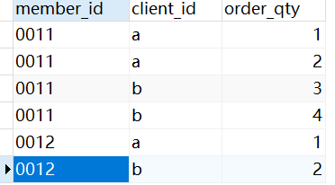
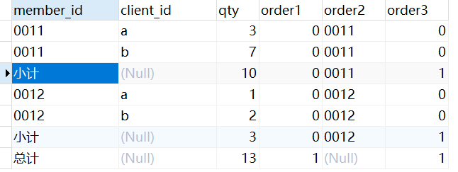
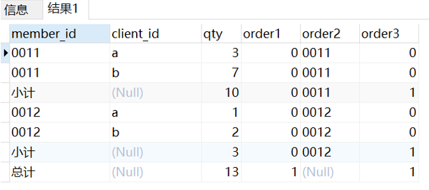

# Subtotal,total statistic method in oracle/mysql/postgre/greenplum

## Requirement

原始数据如下：



subtotal order_qty by member_id,client_id fields, and also total order_qty by member_id,client_id

## Mysql(8.0.13)

```SQL
SELECT
    CASE
        WHEN GROUPING(MEMBER_ID) = 1 THEN '总计'
        WHEN GROUPING(CLIENT_ID) = 1 THEN '小计'
        ELSE MEMBER_ID
    END AS MEMBER_ID,
    CLIENT_ID,
    SUM(ORDER_QTY) AS QTY,
    GROUPING(MEMBER_ID) AS ORDER1,
    MEMBER_ID AS ORDER2,
    GROUPING(CLIENT_ID) AS ORDER3
FROM t_test
GROUP BY MEMBER_ID, CLIENT_ID WITH ROLLUP
ORDER BY ORDER1, ORDER2, ORDER3
```



## Oracle(12.1.0.2) Postgre11.1 Greenplum(6.9)

### 方案一 Rollup

```SQL
SELECT
    CASE
        WHEN GROUPING(MEMBER_ID) = 1 THEN '总计'
        WHEN GROUPING(CLIENT_ID) = 1 THEN '小计'
        ELSE MEMBER_ID
    END AS MEMBER_ID,
    CLIENT_ID,
    SUM(ORDER_QTY) AS QTY,
    GROUPING(MEMBER_ID) AS ORDER1,
    MEMBER_ID AS ORDER2,
    GROUPING(CLIENT_ID) AS ORDER3
FROM t_test
GROUP BY ROLLUP(MEMBER_ID, CLIENT_ID)
ORDER BY ORDER1, ORDER2, ORDER
```

### 方案二 Grouping Sets

```SQL
SELECT
    CASE
        WHEN GROUPING(MEMBER_ID) = 1 THEN '总计'
        WHEN GROUPING(CLIENT_ID) = 1 THEN '小计'
        ELSE MEMBER_ID
    END AS MEMBER_ID,
    CLIENT_ID,
    SUM(ORDER_QTY) AS QTY,
    GROUPING(MEMBER_ID) AS ORDER1,
    MEMBER_ID AS ORDER2,
    GROUPING(CLIENT_ID) AS ORDER3
FROM t_test1
GROUP BY GROUPING SETS((MEMBER_ID, CLIENT_ID), (MEMBER_ID), ())
ORDER BY ORDER1, ORDER2, ORDER3
```


