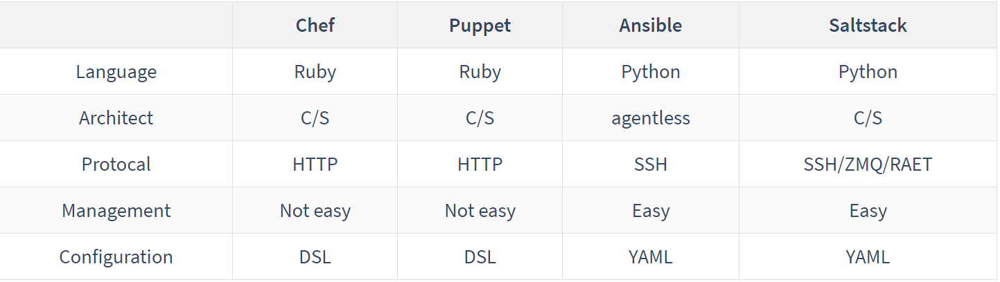
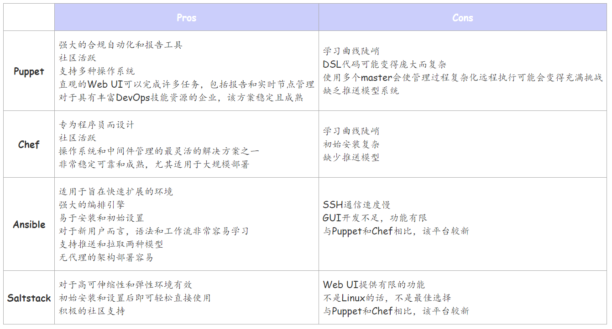

# Ansible简介

## Ansible是什么


Ansible是一个开源自动化工具或平台，用于IT任务，如配置管理、应用程序部署、内部服务编排。自动化在当今是至关重要的，因为IT环境过于复杂，如果必须手动完成所有工作，系统管理员和开发人员往往需要快速跟进。自动化简化了复杂的任务，不仅使开发人员的工作更易于管理，而且允许他们将注意力集中在为组织增加价值的其他任务上。换句话说，它节省了时间，提高了效率。而Ansible，如上所述，正在迅速成长为到自动化工具世界的顶端，2015年Red Hat收购了Ansible，更让Ansible成为DevOps中重要的自动化工具，让我们一起了解下Ansible吧。

## Ansible名字的由来

Ansible取名来自作者Michael DeHaan最喜爱的《Rocannon's World》小说，而这部小说后来被改编成电影Ender's Game（安德的游戏）。片中主角安德和他的伙伴们通过Ansible（安塞波：虚构的超光速通讯装置），跨越时空指挥无数的战舰，和我们工作中通过主机操作远程集群如出一辙，如此的形象。


## Ansible的设计目标

- 最小化原则：管理系统不应该有过多的依赖
- 一致性：使用Ansible，可以构建一致的环境
- 安全：Ansible是agentless，仅仅需要在控制端使用OpenSSH和Python
- 高可靠性：Ansible的剧本具有幂等性，可以有效阻止客户端发生不可预期的问题或其他问题
- 学习曲线低：仅仅需要掌握YAML和Jinja2

## Ansible的技术特点

Ansible使用python编写，支持unix/linux/windows，agentless是其最大优点，在控制端安装python和ansible后，就能通过ssh对远程机器进行操控，因为是agentless，通过ssh操作，所以执行速度略微慢一点，不过也可以通过ansible的并发参数进行速度提升，不是上万台的集群，完全不用担心。

## Ansible的优点

- 免费
- 容易安装和使用
- 功能强大
- 灵活：用户可以任意编排
- 无代理架构：高效

## Ansible的能力


解释Ansible能力之前，我们可以举个例子，比如说我想修改10台机器的名称，分别是A1~A10，传统做法就是一台机器一台修改，好像10台机器也能接受，但是100台机器呢，可能就要花费一些时间了，1000台呢，可能就望天兴叹了，利用Ansible的Paybook和Jinja2模板语言就可以很好的解决这个问题。让我们看看Ansible有哪些主要能力。

- 配置管理

  Ansible被设计成简单、可靠和一致的配置管理。Ansible配置是对基础设施的简单数据描述，人类容易阅读。开始管理系统所需要的只是一个密码或一个SSH密钥。使用配置管理一个简单的例子：如果你想在企业所有的机器上升级一个软件或者修改一个配置文件，所有你要做的是写出所有节点的IP地址，编写一个Ansible剧本，然后运行控制机的剧本就大功告成，而剧本也就几行代码而已。

- 应用部署

  Ansible让你快速和容易地部署应用程序。你不需要编写自定义代码来自动化你的系统，通过编写剧本列出需要完成的任务，Ansible会找出如何让你的系统达到你想要的状态。换句话说，您不必在每台机器上手动配置应用程序，当你在控制机器上运行剧本时，Ansible使用SSH与远程主机通信并运行所有命令。

- 编排

  顾名思义，编排就是把不同的元素融入到整体环境中，就像音乐指挥把所有不同乐器的音符融入到一个连贯的艺术作品中一样。例如，对于应用程序部署，你不仅需要管理前端和后端服务，还需要管理数据库、网络、存储等等，你还需要确保所有任务都按正确的顺序处理。Ansible使用自动化工作流配置和其他功能来简化编排任务。一旦你使用Ansible剧本定义了你的基础设施，你就可以在任何你需要的地方使用相同的编排，这要感谢Ansible剧本的可移植性。

- 安全

  与应用程序部署一样，安全策略可以与其他自动化过程一起实现。如果您在控制机器上配置安全细节并运行相关的剧本，所有远程主机将自动更新这些细节。这意味着你不需要持续地手动监视每台机器的安全性策略。

## 使用Ansible需要哪些技术

- linux命令
- yaml/yml
- jinja2

## 组件对比


ansible属于后起之秀，类似的组件还有Puppet、Chef、Saltstack，他们的技术方案也有很大的不同，适用的场景也不尽相同，通过下面的表格可以简单的了解相关特性





## 20 minutes tutorails

### Ansible 体系结构

- Modules

  模块就像一个小程序，Ansible将它从控制机器推送到所有节点或远程主机上。这些模块可以控制服务、文件等内容，或者其他任何你想执行的操作，Ansible也有类似于市场的概念，市场上提供了数千个modules供你使用。

- Plugins

  插件是增强功能的额外代码片段。Ansible自带了很多插件，但是你也可以自己编写插件。
  
- Inventories

  Ansible所控制的所有机器的列表，可以对列表进行分类，并且在分组的基础上添加变量。

- Playbooks

  剧本就像任务的指导手册，它们是用YAML编写的简单文件。剧本是Ansible如此受欢迎的核心原因，因为它们描述了需要快速完成的任务，而不需要用户知道或记住任何特定的语法。它们不仅可以声明配置，还可以编排任何手动排序任务的步骤，并且可以在同一时间或不同时间执行任务。

另外，Red Hat收购Ansible之后，提供了Ansible Tower，Ansible Tower是基于web的商业解决方案。它最著名的特性是一个易于使用的UI，可以方便管理配置和部署。Ansible Tower包含了Ansible的基本特性，特别是那些更容易以图形格式而不是基于文本格式看到的特性，10个节点以内是免费的。

### Ansible安装

```shell
yum install ansible
或者
pip3 install ansible
```

### 核心配置文件

- /etc/ansible/ansible.cfg：主配置文件
- /etc/ansible/hosts：主机清单

### Ansible command

- **ansible-doc**

  帮助命令，类似于man

  ```shell
  -a           显示所有模块文档
  -l --list    列出可用模块
  -s --snippet 显示指定模块的playbook片段
  
  [root@gardenia1 ~]# ansible-doc -s ping
  -name: Try to connect to host, verify a usable python and return `pong' on success
    ping:
        data:   # Data to return for the 'ping' return value. If this parameter is set to 'crash', the module will cause an exception.
  ```

- **ansible**

  这个命令是ansible的主程序，它可以调用各种模块对远端主机进行配置管理、应用部署、任务执行等功能。ansible有两种方式管理主机，一种是ad-hoc，也就是用ansible这个命令来管理主机，还有一种方式就是用ansible-playbook。

  ```shell
  ansible <host-pattern> [-m module_name] [-a args]
      --version              显示版本
      --list-host            显示主机列表，可简写--list
      -m module              指定模块，默认为command
      -v                     详细过程 -vv -vvv 更详细
      -k --ask-pass          提示输入ssh连接密码。默认key验证
      -K --ask-become-pass   提示输入sudo时的口令
      -C --check             检查不执行
      -T --timeout=TIMEOUT   执行命令的超时时间，默认10s
      -u --user=REMOTE——USER 执行远程执行的用户
      -b --become            代替旧版本的sudo切
  ```

  ```shell
  [root@gardenia1 ~]# tail -2 /etc/ansible/hosts 
  [test]
  192.168.128.128
  [root@gardenia1 ~]# ansible test -m ping       
  192.168.128.128 | SUCCESS => {
      "ansible_facts": {
          "discovered_interpreter_python": "/usr/bin/python"
      }, 
      "changed": false, 
      "ping": "pong"
  }
  [root@gardenia1 ~]# ansible test -m shell -a 'free -h'
  192.168.128.128 | CHANGED | rc=0 >>
                total        used        free      shared  buff/cache   available
  Mem:           1.9G        377M        381M        8.3M        1.2G        1.4G
  Swap:          4.0G        1.3M        4.0G
  ```

  常用模块介绍

  - command

    远程主机执行命令，默认模块，可忽略-m选项，不支持变量、管道、输入输出重定向等功能

    ```shell
    ansible all -m command -a 'systemctl restart sshd'
    ansible all -a 'systemctl restart sshd'
    ```

  - shell

    在远程主机运行shell命令

    ```shell
    ansible all -m shell -a 'echo magedu | grep ma'
    ```

  - script

    在远程主机上执行ansible主机上的脚本，且不需要将脚本复制到被执行的远程主机上

    ```shell
    ansible all -m script -a 'chdir=/opt /opt/test.sh'
    ```

  - copy

    从ansible控制服务器复制文件到远程客户端

    ```shell
    # 将控制机的文件复制到远程客户端
    ansible all -m copy -a 'src=/home/dce//test1 dest=/home/dce/test1 backup=yes mode=0755 owner=dce'
    
    # 直接把内容复制到远程主机的文件里
    ansible all -m copy -a "content='test content\n' dest=/home/dce/f1.txt"
    ```

  - fetch

    从远程客户端取文件至ansible控制服务器，与copy相反

    ```shell
    ansible all -m fetch -a 'src=/home/dce/a.sh dest=/home/dce/f2.sh'
    ```

  - file

    设置文件属性（状态，属组，属主，权限）

    ```shell
    #创建文件
    ansible all -m file -a 'path=/home/dce/a.sh owner=dce mode=755'
    #文件链接
    ansible all -m file -a 'src=/home/dce/a.sh dest=/home/dce/test state=link'
    #创建文件
    ansible all -m file -a 'name=/home/dce/f3 state=touch'
    #删除文件
    ansible all -m file -a 'name=/home/dce/f3 state=absent'
    #创建目录
    ansible all -m file -a 'name=/home/dce/data state=directory'
    #目录链接
    ansible all -m file -a 'src=/home/dce/data dest=/home/dce/data_link state=link'
    ```

  - archive

    文件压缩打包

    ```shell
    ansible all -m archive -a "path=/home/dce/data format=gz dest=/home/dce/data.tar.gz"
    ```

  - unarchive

    解压

    ```shell
    ansible all  -m unarchive -a 'src=/home/dce/data.tar.gz dest=/home/dce'
    ```

  - hostname

    设置主机名称

    ```shell
    #inventory file
    [web]
    172.16.252.1  hostname=host1
    172.16.252.2  hostname=host2
    172.16.252.3  hostname=host3
    172.16.252.4  hostname=host4
    ansible web -m hostname -a 'name={{ hostname }}'
    ```

  - yum

    安装软件包

    ```shell
    ansible all -m yum -a 'name=telnet state=latest'
    ```

  - user

    用户管理模块

    ```shell
    ansible all -m user -a 'name=dce1 group=dev2'
    ```

  - group

    组管理模块

    ```shell
    #新建组
    ansible all -m group -a 'name=dev2 state=present'
    #删除组
    ansible all -m group -a 'name=dev2 state=absent'
    ```

  - lineinfile

    修改文件内容

    ```shell
    #将/home/dce/test文件中以line开头的行末尾加上abcd（利用反向引用支持）
    ansible all -m lineinfile -a 'path=/home/dce/test regexp="(^line.*)" line="\1abcd" backrefs=yes'
    ```

  - blockinfile

    帮助我们在指定的文件中插入"一段文本"，这段文本是被标记过的

    ```shell
    # BEGIN ANSIBLE MANAGED BLOCK
    systemctl start mariadb
    systemctl start httpd
    # END ANSIBLE MANAGED BLOCK
    ansible all -m blockinfile -a 'path=/home/dce/rc.local block="systemctl start mariadb\nsystemctl start httpd"'
    ```

  - systemd

    管理linux服务

    ```shell
    ansible all -m systemd -a 'name=httpd state=started'
    ```

  - template

    支持jinja2

    ```shell
    ansible all -m template -a 'src=/home/dce/test.j2 dest=/home/dce/test'
    ```

  - setup

    收集远程主机的信息

    ```shell
    #获取远程主机的ipv4地址
    ansible all -m setup -a 'filter=ansible_default_ipv4_addresses'
    #获取远程主机的内存信息
    ansible all -m setup -a 'filter=ansible_memory_mb'
    ```

- **ansible-playbook**

  执行剧本命令

  ```shell
  [root@gardenia1 ~]# cat test.yml
  - hosts: all 
    remote_user: root
    tasks:
      - name: test
        command: /usr/bin/wall hello world
        
  [root@gardenia1 ~]# ansible-playbook ./test.yml 
  PLAY [all] ***************************************************************************
  TASK [Gathering Facts] ***************************************************************
  ok: [192.168.128.128]
  TASK [test] **************************************************************************
  Broadcast message from root@gardenia1 (pts/2) (Sat Jan 16 17:16:47 2021):
  
  hello world
  changed: [192.168.128.128]
  
  PLAY RECAP ****************************************************************************
  192.168.128.128   : ok=2  changed=1  unreachable=0  failed=0  skipped=0  rescued=0  ignored=0   
  ```
  
- **ansible-console**

  可交互式执行ansible命令，支持tab补全，常用于ad-hoc和ansible-playbook之间的场景，常用于集中一批临时操作或命令

  ```shell
  [root@gardenia1 ~]# ansible-console
  Welcome to the ansible console.
  Type help or ? to list commands.
  
  root@all (1)[f:5]$ list
  192.168.128.128
  root@all (1)[f:5]$ ping
  192.168.128.128 | SUCCESS => {
      "ansible_facts": {
          "discovered_interpreter_python": "/usr/bin/python"
      }, 
      "changed": false, 
      "ping": "pong"
  }
  ```

- **ansible-galaxy**

  指令用于从https://galaxy.ansible.com/ 站点下载第三方扩展模块，我们可以形象的理解其类似于centos下的yum，下载后的角色role就可以直接在playbook中使用。

  ```shell
  [root@gardenia1 ~]# ansible-galaxy role -h
  usage: ansible-galaxy role [-h] ROLE_ACTION ...
  
  positional arguments:
    ROLE_ACTION
      init       Initialize new role with the base structure of a role.
      remove     Delete roles from roles_path.
      delete     Removes the role from Galaxy. It does not remove or alter the actual GitHub repository.
      list       Show the name and version of each role installed in the roles_path.
      search     Search the Galaxy database by tags, platforms, author and multiple keywords.
      import     Import a role.
      setup      Manage the integration between Galaxy and the given source.
      info       View more details about a specific role.
      install    Install role(s) from file(s), URL(s) or Ansible Galaxy
  ```
  
  ```shell
  [root@gardenia1 ~]# ansible-galaxy role install geerlingguy.redis
  -downloading role 'redis', owned by geerlingguy
  -downloading role from https://github.com/geerlingguy/ansible-role-redis/archive/1.7.0.tar.gz
  -extracting geerlingguy.redis to /root/.ansible/roles/geerlingguy.redis
  -geerlingguy.redis (1.7.0) was installed successfully
  [root@gardenia1 ~]# ansible-galaxy role list
  # /root/.ansible/roles
  -geerlingguy.redis, 1.7.0
  # /usr/share/ansible/roles
  # /etc/ansible/roles
  ```
  
- **ansible-pull**

  该指令使用Ansible的另一种工作模式：pull 模式（Ansible默认使用push模式）。这和通常使用的push模式工作机理刚好相反。Ansible-pull命令使用格式如下：
  ansible-pull [options] [playbook.yml]
  通过Ansible-pull结合git或者crontab，定期拉取指定的playbook版本到本地, 并以指定模式自动运行预先制订好的指令。

- **ansible-vault**

  管理加密/解密yml(palybook)文件工具，有时编写的playbook文件中会存在重要信息，考虑到安全，可以使用此工具进行加密。

  ```shell
  [root@gardenia1 ~]# ansible-vault -h
  usage: ansible-vault [-h] [--version] [-v]
                       {create,decrypt,edit,view,encrypt,encrypt_string,rekey}
  encryption/decryption utility for Ansible data files
  positional arguments:
    {create,decrypt,edit,view,encrypt,encrypt_string,rekey}
      create              Create new vault encrypted file
      decrypt             Decrypt vault encrypted file
      edit                Edit vault encrypted file
      view                View vault encrypted file
      encrypt             Encrypt YAML file
      encrypt_string      Encrypt a string
      rekey               Re-key a vault encrypted file
  ```

下一篇文章我会利用Ansible制作集群双向互信，自互信的脚本。
