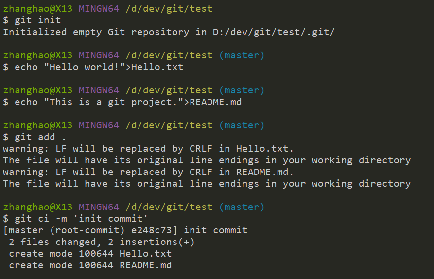
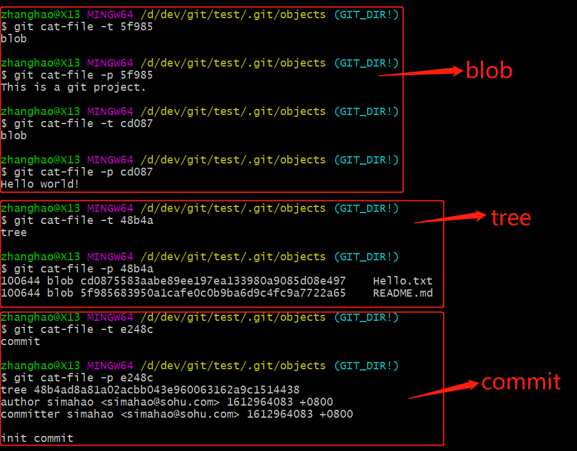
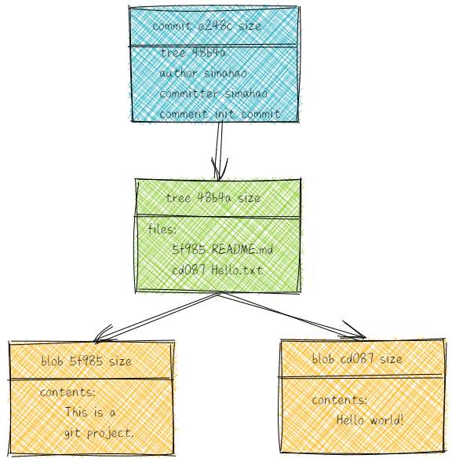
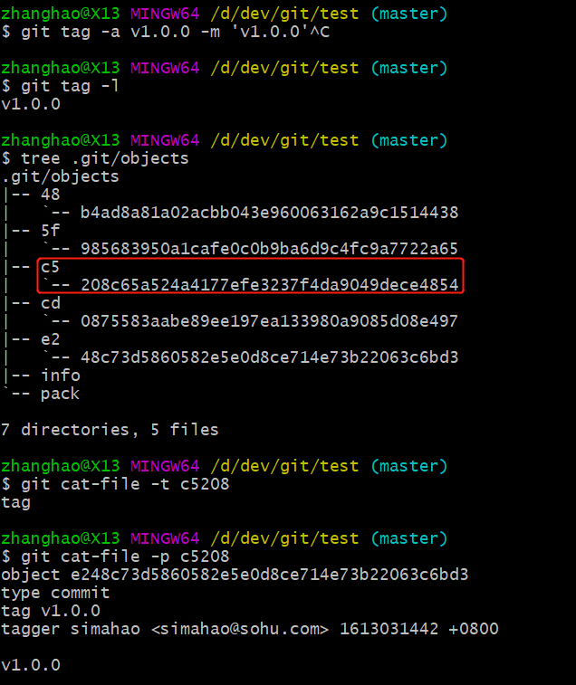
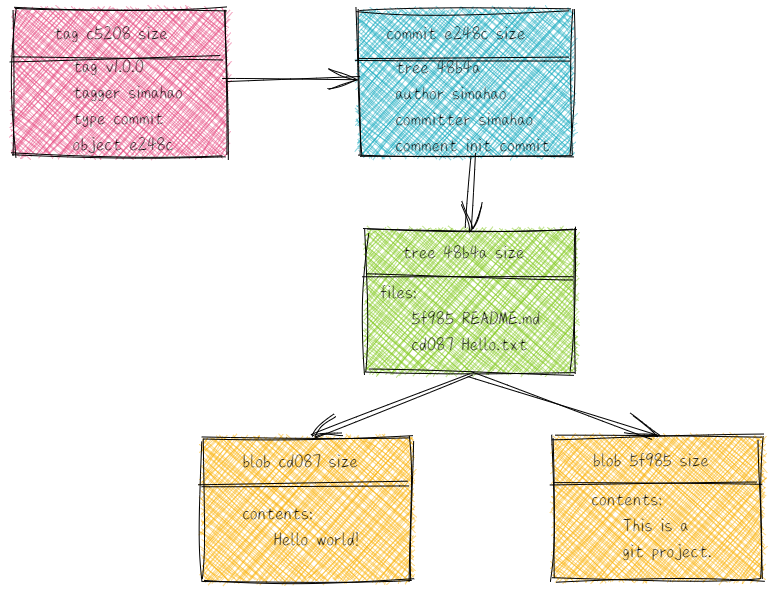
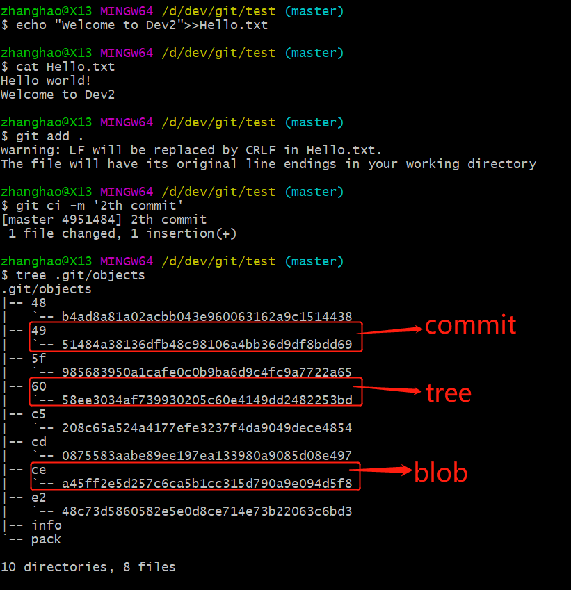
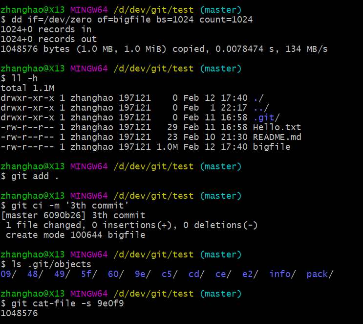
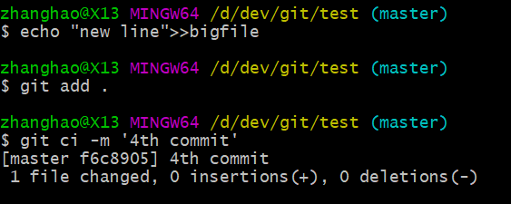
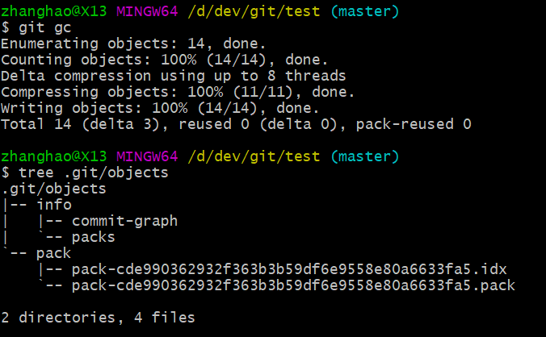
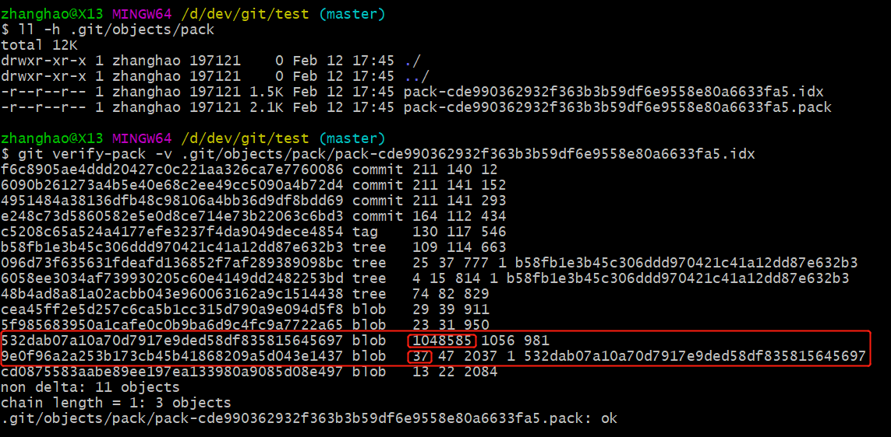

# GIT 原理简介

一个Git 仓库是一个小型的数据库，其中包含文件修改的所有信息。与大多数版本控制系统一样，在Git中，存储库会在整个生命周期中保留整个项目的完整副本。但是，与其他VCS不同，Git存储库不仅提供了存储库中所有文件的完整工作副本，甚至还提供了存储库本身的副本。

Git存储库中维护一组配置值（Key-Value），例如用户的名称和电子邮件地址。与文件数据和其他存储库元数据不同，在克隆或复制操作期间，配置设置不会自动从一个存储库传播到另一个存储库（默认为仓库级别的参数，也可以设置为全局模式）。

在存储库中，Git维护两个主要数据结构，对象库和索引。所有这些存储库数据都存储在工作目录的根目录中，该目录为 **.git**，也就是Git的“数据库”。

Git的分布式机制是通过clone操作时将对象复制到本地来实现的，接下来将详细地描述Git的对象类型和存储。

## Git对象类型

Git存储库实现的核心是对象存储。它包含原始数据文件和所有日志消息，作者信息，日期以及重建项目的任何版本或分支所需的其他信息。Git在对象存储库中有四种类型的对象： blob，tree， commit和tag，这四个原子对象构成了Git高级数据结构的基础。

**blob**

blob（二进制大对象）对象用于存储单个文件的内容，文件的每一个版本均通过 blob存储。Blob保留文件的数据，但不包含这个文件的任何元数据，比如说文件名就不在Blob中存放。

**tree**

一个tree对象代表目录信息的层级结构，树对象包含对其他blob或子树的引用，从而构建文件和子目录的完整层次结构。

**commit**

一个commit对象保留引入存储库的每个更改的元数据，包括作者，提交者，提交日期和日志消息。每个提交都指向一个树对象，该对象在一个完整的快照中捕获执行提交时存储库的状态。

**tag**

一个tag分配到一个特定的对象上，这个对象通常是一个提交，比如说Ver1.0.0这个标签。

## Git存储介绍

首先，我们创建一个测试仓库，添加两个文件，分别为Hello.txt和README.md，并将两个文件进行stage和commit，我们具体观察下.git的结构，并借助这个例子具体分析下对象类型的结构和关系。

接下来，我们看看提交之后，git的仓库的结构有哪些对象数据产生。

在 .git/objects目录下，有四个新的子目录产生，每个子目录又会产生一个文件，子目录由SHA-1的前两位组成，使用SHA-1作为参数的时候，要将目录的2位和文件的38位连接起来，比如说要使用`48b4a`，不能使用`b4ad8`。

git提供了一组辅助命令，其中cat-file子命令可以查看对象的类型和内容，其中`-t`参数显示对象类型，`-p`参数显示对象的具体内容，我们通过cat-file看看这四个对象是什么类型，内容是什么。

为了清楚的展现出git是如果关联起这些对象的，可以通过下面的手绘图理解。

这个时候，我们可以创建一个tag，看看objects目录下面会发生怎样的变化

创建tag之后的逻辑关系如下手绘图

我们通过上面的例子，可以初步了解git内部的存储结构，以及这些对象是如何关联在一起的，接下来，我们再做一次提交，看看git的存储结构和关系发生了哪些变化。

我在Hello.txt添加了一行文字，并提交，提交消息为"2th commit"，因为这次提交我并没有修改README.md，所以git并不会再次生成README.md的blob文件，而是高效重复利用第一次产生的blob文件，具体结果如下手绘

## 杂项

### SHA-1如何保证唯一

SHA-1(Secure Hash Algorithm 1)，git使用40位16进制表示（e.x. 55eb4229851634a0f03eb265b69f5a2d56f341），实际是160 bit，我们可以初步测算一下，$2^{160}\approx10^{48}(令2^{160}=x;两边同取以10为底的对数后 160\times lg^2=lg^x;160\times 0.3=lg^x; 所以 x\approx 10^{48})$，这个数字有多大，你甚至都理解不了，可以举个例子直观感受下，你雇佣一万亿个员工，每个人每秒产生一个blob对象，一秒合计产生一万亿个对象，按照这个速度，一万亿年后，也才产生$10^{43}$个blob对象，所以在一个repository，即使是分布式的，有1000个contributors，能产生冲突的可能性基本没有。

### git如何保证历史不被篡改

假设你偷偷修改了历史变更记录上一个文件的内容，那么这个文件的blob object的SHA-1哈希值就变了，与之相关的tree object的SHA-1也需要改变，commit的SHA-1也要变，这个commit之后的所有commit SHA-1值也要跟着改变。又由于Git是分布式系统，即所有人都有一份完整历史的Git仓库，所以所有人都能很轻松的发现存在问题，感觉和区块链有种似曾相识的赶脚。

### 为什么文件的元数据(文件名)信息不保存在文件的blob中，而是在tree对象中

主要原因还是充分节约存储空间，我们假设要修改文件名称，如果将文件名保存在blob里面，那么git只能多复制一份原始内容形成一个新的blob，而git的实现方法是创建一个新的tree对象将对应的文件名更改成新的即可，原本的文件blob 可以复用。这种策略在文件是一个size较大的场景，就体现出高效、节约空间的优势了。

### pack files

如果留心的话，你会发现运行完`tree .git/objects`命令后，有一个pack目录，这个目录的主要目的就是存放压缩后的文件，以便大幅减少文件占用的空间。git在版本管理上采用了混合模式，也就是本地仓库会对文件的内容的每一次变化进行全量存储，在这一点上并非像大家想象的那样，先存储一个文件的基版本，然后每次存储deltas值。另外git会偶尔主动发起gc的操作，将本地的对象值进行压缩存储。另外，当使用push命令将版本的变化推送到远端时，远端也会通过pack的方式进行对象的压缩存储，这样可以保证clone的时候尽可能高效的在网络上传输。

我们首先通过dd命令创建一个1M的大文件，并将其stage和commit。

commit之后，我们通过tree命令可以看到，增加了9eof9对象，通过`-s`参数可以看到这个对象大小的确是1M。之后我们针对这个文件添加一行内容，让文件有一个微小的变动并stage和commit。

然后我们通过git gc命令将本地的各种对象进行压缩存储，执行完成后，.git/objects目录下的子目录都被删除，pack目录下增加了idx文件和pack文件。

接下来，我们通过`git verify-pack`命令可以显示出pack文件中的内容，`532da`对应的bigfile大小是第三列的数值，大小为1048585，原始文件为`9e0f9`，大小为37，这里面涉及到git的策略，就是git认为文件的最新版本是最经常使用的，因此在全量保存一个文件的时候，会选择最新版本，而历史版本在压缩过程中，会进行delta模式进行保存。

还有一点需要注意，当我们从github clone一个项目到本地的时候，只有pack文件，这样做就是我之前提到的原因，提升网络传输效率。

## 总结

git教程分两部分，第一部分为常用命令讲解和周边衍生工具链介绍，第二部分为git的一些基本原理，到此，git的介绍完结，希望大家能够从实际使用，原理两个方面，不同视角学习掌握git。

下一篇为DevOps中部署相关的Ansible介绍（上）。

