# Git tutorial and best practice

- [Git tutorial and best practice](#git-tutorial-and-best-practice)
  - [How to config git](#how-to-config-git)
    - [set config](#set-config)
    - [get config](#get-config)
  - [How to create alias](#how-to-create-alias)
  - [How to create a repository](#how-to-create-a-repository)
  - [How to use add](#how-to-use-add)
  - [How to use commit](#how-to-use-commit)
  - [How to use reset](#how-to-use-reset)
    - [mode](#mode)
    - [usage](#usage)
  - [How to use restore](#how-to-use-restore)
  - [How to use branch](#how-to-use-branch)
  - [How to use merge](#how-to-use-merge)
  - [How to use rebase](#how-to-use-rebase)
    - [rebase senario one](#rebase-senario-one)
    - [rebase senario two](#rebase-senario-two)
  - [How to use diff](#how-to-use-diff)
  - [How to use tag](#how-to-use-tag)
  - [How to use stash](#how-to-use-stash)
  - [How to use remote command](#how-to-use-remote-command)
    - [How to use clone](#how-to-use-clone)
    - [How to use push](#how-to-use-push)
    - [How to use fetch](#how-to-use-fetch)
    - [How to use pull](#how-to-use-pull)
  - [Git Work Flow](#git-work-flow)
    - [work flow](#work-flow)
    - [How to use branch in your project management](#how-to-use-branch-in-your-project-management)
    - [How to pull request in teamwork](#how-to-pull-request-in-teamwork)
    - [workflow](#workflow)
  - [How to use revision](#how-to-use-revision)
  - [Miscellaneous](#miscellaneous)
    - [How to execute 'git push' without prompt of user and password](#how-to-execute-git-push-without-prompt-of-user-and-password)
    - [How to config PS1](#how-to-config-ps1)
    - [Create tar that include changed file](#create-tar-that-include-changed-file)
    - [How to upgrade git version](#how-to-upgrade-git-version)
    - [Difference between tow-dot and three-dot](#difference-between-tow-dot-and-three-dot)
    - [back to future](#back-to-future)
    - [pathspec](#pathspec)
    - [Ignore file](#ignore-file)
    - [git commit lint](#git-commit-lint)
      - [type-enum](#type-enum)
      - [type-case](#type-case)
      - [type-empty](#type-empty)
      - [scope-case](#scope-case)
      - [subject-case](#subject-case)
      - [subject-empty](#subject-empty)
      - [subject-full-stop](#subject-full-stop)
      - [header-max-length](#header-max-length)
    - [Warnings](#warnings)
      - [body-leading-blank](#body-leading-blank)
    - [changelog](#changelog)
      - [changelog workflow](#changelog-workflow)
    - [Command cheat](#command-cheat)

## How to config git

git的配置文件分为三个级别，分别是：

- system：负责本机全部用户, PATH=$INSTALL_PATH/etc/gitconfig

- global：本用户下所有仓库， PATH=~/.gitconfig

- local：仅仅负责当前仓库，PATH=$REPO/.git/config

可以通过```git config --[system|global|local] -e```命令，交互式修改配置文件

### set config

以global举例：

```sh
git config --global --add cat.name tom
gig config --global --replace-all cat.name jerry
git config --global --unset cat.name
```

注意：variable=section.key， section部分不可缺少

### get config

```sh
git config --global --get user.name
git config --global -l
```

## How to create alias

通过alias可以快速完成命令

```sh
git config --global user.name "simahao"
git config --global user.email "abc@domain.com"
git config --global alias.st status
git config --global alias.co checkout
git config --global alias.sw switch
git config --global alias.ci commit
git config --global alias.br branch
git config --global alias.last 'log -1'
git config --global alias.unstage 'reset HEAD'
git config --global alias.lg "log --color --graph --pretty=format:'%Cred%h%Creset -%C(yellow)%d%Creset %s %Cgreen(%cr) %C(bold blue)<%cn>%Creset' --abbrev-commit"
```

## How to create a repository

- 仅本地

  ```sh
  git init
  ```

- 先建立本地再关联远程

  ```sh
  git init
  ...
  git commit -m 'commets'
  ```

  在github或者gitea上创建远程仓库， 为了避免歧义，最好将远程仓库名称保持和本地已经建立好的仓库名称一致

  ```sh
  git remote add origin https://domain/path/repo-name.git
  git push -u origin master
  ```

  -u --set-upstream: set upstream for git pull/status
  git push -u origin master只需要在第一次运行，为了将本地的master和远程origin/master进行关联, 之后如果推送master到远程，只需要```git push```即可
- 先建立远程

  首先要在github或者gitea上创建仓库，然后在本地执行```git clone http://RUL/path/repo-name.git```

## How to use add

  ```git add [-A|-u|.]```

- -A

  文件的修改，文件的删除，文件的新建添加到暂存区

- -u

  文件的修改、文件的删除添加到暂存区

- .

  文件的修改，文件的新建，添加到暂存区

  | flag  |  new  | update | delete |
  | :---: | :---: | :----: | :----: |
  |  -A   |   √   |   √    |   √    |
  |  -u   |   ×   |   √    |   √    |
  |   .   |   √   |   √    |   ×    |

建议使用```git add -A```

## How to use commit

- 正常提交

  ```sh
  git commit -m 'comment'
  ```

- 对于已经tracked的文件，快速提交

  ```sh
  git commit -am 'comment'
  ```

- 将某个分支的提交应用在另外一个分支上

  - cherry-pick one commit

    ```sh
    git checkout/switch master
    git cherry-pick commitid(master's lastest commitid)
    ```

  - stash

    ```sh
    git co master
    git stash push filename
    git co dev
    git stash pop/apply
    git add .
    git ci -m 'comment'
    ```

- 提交后，发现本次提交漏掉一些文件
  - amend
    可以使用修补模式，通过--amend参数，将漏掉和文件和上次提交合并

    ```sh
    git commit --amend
    ```

  - rebase
    将漏掉的文件commit之后，执行```git rebase -i HEAD~2```， 通过squash模式合并两次提交，其中squash会提示我们重新编辑comment，fixup会抛弃后面的comment，使用上一次提交的comment

    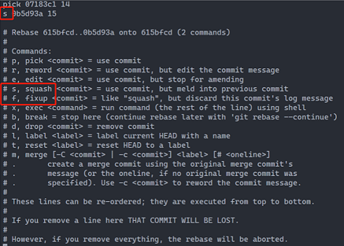

  - reset

    ```sh
    git reset commitid
    git add .
    git commit -m 'comment'
    ````

## How to use reset

### mode

git reset命令有三种模式，分别是mixed，soft，hard， 其中mixed是默认模式

- mixed

  1->2->3->4(HEAD)

  ```sh
  git reset 3
  ```

  执行之后变成1->2->3(HEAD)，working tree还保留着commitid=4的修改状态，index和repo为commitid=3的状态，这种场景多用于最新的提交错误，需要继续修改

- soft

  1->2->3->4(HEAD)

  ```sh
  git reset --soft 3
  ```

  执行之后变成1->2->3(HEAD)，working tree和index还保留着commitid=4的修改状态，repo为commitid=3的状态

- hard

  1->2->3->4(HEAD)

  ```sh
  git reset --hard 3
  ```

  执行之后变成1->2->3(HEAD)，working tree、index、repo都为commitid=3的状态

  | working tree | index | head  | target commitid |  flag   | working tree | index | head  |
  | :----------: | :---: | :---: | :-------------: | :-----: | :----------: | :---: | :---: |
  |      A       |   B   |   C   |        D        | --soft  |      A       |   B   |   D   |
  |              |       |       |                 | --mixed |      A       |   D   |   D   |
  |              |       |       |                 | --hard  |      D       |   D   |   D   |

### usage

- 针对已经跟踪的文件，修改后未add

  ```git co -- file```

- add之后

  ```git reset HEAD```

- commit之后

  ```git reset --hard HEAD~N```

## How to use restore

restore命令可以将working tree或者stage进行恢复

- -S --staged

  相当于将git add操作取消，将stage恢复到add之前的状态

- -W --worktree

  没有执行add之前，这个参数相当于放弃working tree的所有修改，```git restore -WS -- <pathspec>```相当于清空stage，working tree恢复到修改之前

## How to use branch

- 创建并切换分支

  ```git co -b dev```

- 创建分支切换分支，并从远程仓库拉取代码

  ```git co -b dev origin/dev```

- 修改本地分支名称

  ```git branch -m <new_branch_name>```

- 删除本地分支
  - 删除已经合并完成的分支

    ```git br -d dev```

  - 强制删除分支，即使未合并

    ```git br -D dev```

    ```git br -d -f dev```

- 查看分支
  - 查看本地分支

    ```git branch```

  - 查看远程分支

    ```git branch -r```

  - 查看所有分支

    ```git branch -a```

  - 正则显示分支

    ```git branch --list d*```

- 合并分支

  将dev分支合并到master

  ```sh
  git co master
  git merge dev
  ```

- 创建远程分支

  ```git push origin dev```

- 修改远程分支名称

  ```git push origin :<old_branch_name> <new_branch_name>```

- 删除远程分支

  ```sh
  git push origin :dev
  or
  git push origin --delete dev
  ```

- 本地分支关联远程分支

  ```git branch -u origin/serverfix```

## How to use merge

  有master分支和topic分支，当前在master分支上

  ```text
      A---B---C topic
     /
    D---E---F---G master
  ```

  如果想将topic上的A/B/C三次提交在master上重放，可以利用merge命令进行，合并后的状态可能是这样的，H是合并后的提交

  ```text
     A---B---C topic
    /         \
    D---E---F---G---H master
  ```

  当合并的过程中发生了冲突，可以利用git merge --abort进行终止操作，特别需要注意的是，如果本地有一些重要的修改，还没有提交，git的merge操作不能保证--abort一定返回之前的状态，因此merge前要保持working tree干净。merge有三种主要的方式，利用下面这张图说明一下三种方式的不同

  master文件

  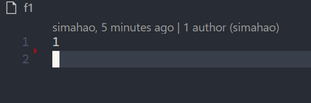

  dev分支文件经过2次提交后

  

- --no-ff
  - 即使git认为可以使用fast方式，也会产生一次commit操作
  - 如果合并tag，默认会采用这种方式

    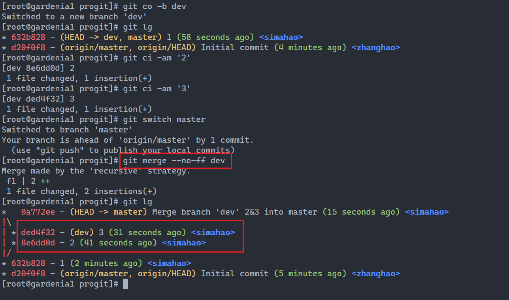

- --squash
  - 分支dev，里面有大量的提交信息，当进行向master的合并时，这些信息过于冗余，可以针对这些提交信息总结出一个正式的说明，可以利用--squash（压缩），merge命令执行后，需要单独执行一次commit操作，将dev分支的所有变化作为master上的一个commit

    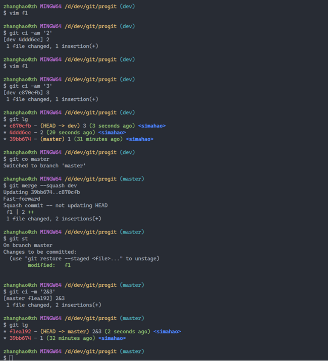

- --ff
  - 如果git判断可以执行fast方式，默认会执行这种方式
  - 这种方式的特点就是仅仅移动head的指针，并不会产生新的提交，达到快速合并的目的

    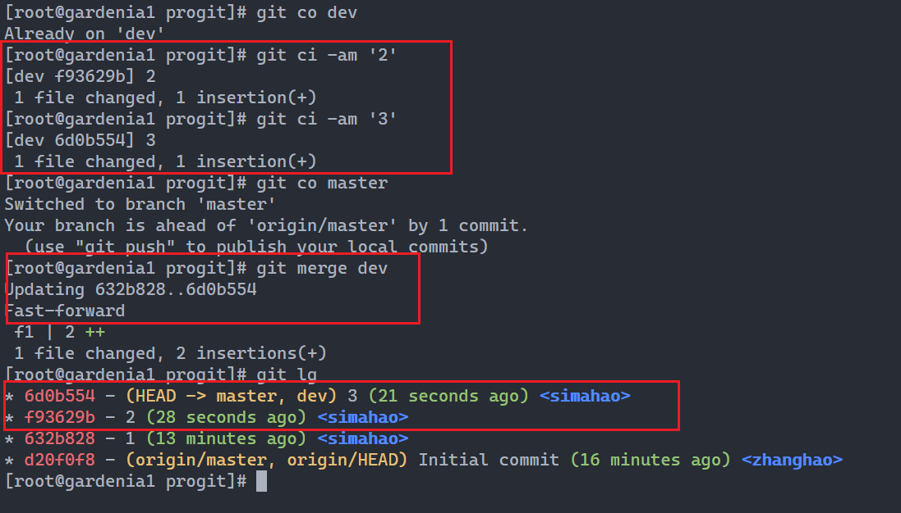

三种模式的区别


## How to use rebase

rebase中文翻译叫做变基，也就是把commit log的基础进行重新定义，一般用作pull，PR，分支合并中，变基的好处是将其他仓库的commit log合并入我的仓库的提交主线中，避免凌乱的提交日志


### rebase senario one

rebase的功能非常丰富，一般通过交互式方式进行```git rebase -i <after-this-commit>```，常用的选项包含：

- pick

  选中这个提交

- reword

  使用这个提交，但是可以重新修改提交日志信息

- edit

  使用这个提交，但是可以使用amend的功能

- squash

  使用这个提交，但是将该提交同之前的提交合并，提交日志也合并到之前的日志中

- fixup

  使用这个提交，但是放弃这个提交的日志信息

- drop

  删除这个提交

如果交互式操作过程中，出现了错误，可以使用```git rebase --edit-todo```重新回到交互式画面

### rebase senario two

分支合并货真变化基础分支，可以使用rebase的功能

```text
      A---B---C topic
      /
D---E---F---G master
```

```sh
git co topic
git rebase master
or
git rebase master topic
```

结果变成

```text
              A'--B'--C' topic
              /
D---E---F---G master
```

如果master和topic都包含相同的提交内容(A和A')

```text
      A---B---C topic
      /
D---E---A'---F master
```

结果变成

```text
                B'---C' topic
              /
D---E---A'---F master
```

假设我们有如下提交结构

```text
o---o---o---o---o  master
    \
      o---o---o---o---o  next
                      \
                        o---o---o  topic
```

我们想让topic分支从master分叉

```sh
git co topic
git rebase --onto master next topic
```

结果变成

```text
o---o---o---o---o  master
    |            \
    |             o'--o'--o'  topic
    \
      o---o---o---o---o  next
```


## How to use diff

- working tree VS index

  ```git diff```

- index VS repo

  ```git diff --cached [<path>...]```

- working tree VS repo

  ```git diff HEAD```

- working tree VS commitid

  ```git diff commitid [<path>...]```

- index VS commitid

  ```git diff --cached commitid [<path>...]```

- commitid Vs commitid

  ```git diff commitid commitid```

## How to use tag

- 创建tag

  ```git tag v1.0```

- 删除tag

  ```git tag -d v1.0```

- 查看tag

  ```git tag```

- 推送tag到远程

  ```git push origin v1.0```

- 删除远程tag

  ```git push origin :refs/tags/v1.0```

## How to use stash

  我们不想提交完成一半或者不完善的代码，但是却需要修改一个紧急Bug，那么就应该使用'git stash'，将你当前未提交到本地（和服务器）的代码推入到Git的stash栈中，这时候你的工作区间和上一次提交的内容是完全一样的，所以你可以创建分支，修改bug等，等完成bug提交后，再使用'git stash apply'将以前工作状态找回来

- 显示栈信息

  ```git stash list```

- 入栈

  ```git stash```

- 目录或者文件入栈

  ```git stash push path```

- 运用栈

  ```git stash apply```

- 出栈

  ```git stash pop```

- 删除栈

  ```git stash drop stash@{N}```

- 清理所有

  ```git stash clear```

## How to use remote command

### How to use clone

- 跟踪远程仓库，产生.git目录，产生工作区

  ```git clone url```

- 不产生工作区，不产生.git目录

  ```git clone --bare url```

### How to use push

push之前，需要先将本地分支和远程进行关联

```sh
git remote add origin git@domain:path/repo-name.git
git remote add origin https://domain/path/repo-name.git
git push -u origin master
```

### How to use fetch

获取origin/master分支代码，拿到后不会自动合并，需要显示调用merge命令。另外，可以通过```git br -r```看到origin/master分支
```git fetch origin master```

### How to use pull

- git pull

  ```git pull```命令等价于```git fetch + git merge```两条命令，这种方式可能会导致合并后的commit log凌乱

- git pull --rebase

  ```git pull --rebase```命令等价于```git fetch + git rebase```两条命令，这种方式针对合并后的commit log，可以减少log的分叉现象

## Git Work Flow

### work flow


### How to use branch in your project management

- master

  从maser上的节点打tag

- develop

  开发分支，用的最多的分支

- release

  准备发布的分支，比如说RC，可以继续在上线修复Release之前的问题

- bugfix

  紧急问题修复分支，需要及时合并回develop分支，或者master分支

- feature

  新的重要特性分支

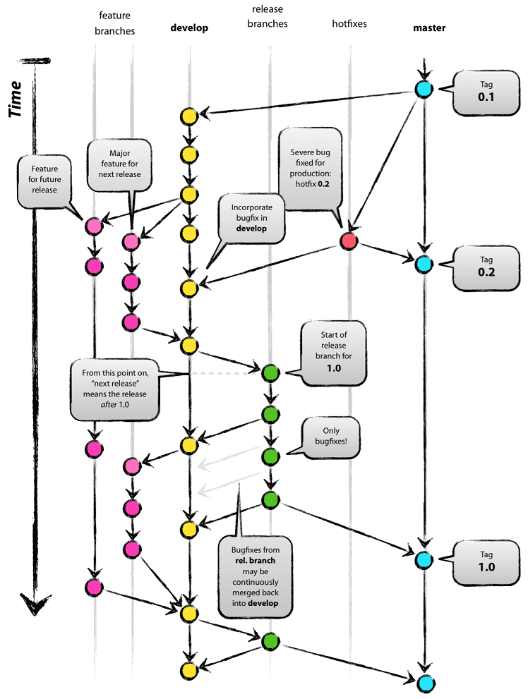

### How to pull request in teamwork

在github/gitea的管理模型中，一般的做法是，contributor fork原始项目，进行bugfix或者feature的开发，然后通过PR的方式提交申请，由项目的owner进行代码的审核和合并操作


### workflow

- 在forked的项目中提交PR，确认是否有代码冲突，如果有冲突，首先要解决冲突。解决冲突的方式就是要拉取'upstream'的代码，在本地解决冲突，解决完毕后，上传代码到forked的remote仓库，然后再由upstream的repository的owner进行PR
- 在原始的仓库中处理合并操作，合并的操作可以选择下面四种
  - pull and merge

    默认模式，该模式下，会产生commit log的分叉，记录forked repository的commits

    

  - rebase and merge

    rebase模式下，先进行rebase，如果没有代码冲突，会采用ff模式，forked repository产生的提交会进入原始仓库的commit log的主线上；如果有代码冲突，需要在本地先从原始仓库上获取代码，并在本地合并冲突

    ```sh
    git remote add upstream url
    git pull --rebase upstream master
    merge conflicts
    git push -f
    ```

    

  - rebase and merge(--no-ff)

    这种模式同rebase&merge相比，相同点是都会先进行rebase，不同点是进入原始项目的commit log会保留forked repository的commit log信息，在原始项目的commit log形成分叉。另外，同pull&merge相比，这种模式下分叉的commit hashid也会和原始提交的hashid不同，会产生一个新的hashid

    

  - squash and merge

    压缩模式下，会将forked repository产生的分支进行压缩，产生一个提交，并merge到原始项目中，这种模式下会产生一个问题，就是forked repository如果提交这次PR之后，还想继续提交PR，就会产生与原始项目的代码冲突，需要进行合并，因此squash and merge使用的场景一般为一次性的

    

## How to use revision

有如下提交，A是最后产生的提交， 为了形象化，BC水平，DEF水平，GHIJ水平，其实代表的是分支提交，有先有后，但是从A节点的角度来看，但是B和C都是A的祖先，如何来表达B，又如何来表达C？git中用~表示一个提交的第n个祖先提交，^用来表示一个提交的第n个父提交（B是A的第一个父提交，C就是A的第二个父提交）

```text
G   H   I   J
 \ /     \ /
  D   E   F
   \  |  / \
    \ | /   |
     \|/    |
      B     C
       \   /
        \ /
         A
```

```text
A =      = A^0
B = A^   = A^1     = A~1
C = A^2  = A^2
D = A^^  = A^1^1   = A~2
E = B^2  = A^^2
F = B^3  = A^^3
G = A^^^ = A^1^1^1 = A~3
H = D^2  = B^^2    = A^^^2  = A~2^2
I = F^   = B^3^    = A^^3^
J = F^2  = B^3^2   = A^^3^2
```

## Miscellaneous

### How to execute 'git push' without prompt of user and password

- https:credential

    如果希望所有仓库都实现免密push，可以执行global模式，如果仅仅想实现某一个仓库的免密登录，则使用local模式限定即可

    ```sh
    git config --global credential.helper store
    git config --global push.default simple
    ```

    执行完配置之后， 需要执行一次push，输入用户名和密码，之后就可以免密push操作了
    

- ssh:authorization

    ```sh
    ssh-keygen -t rsa
    sign in github/gitea
    setting->SSH/GPG Keys->Add key
    cat ~/.ssh/id_rsa.pub
    ```

    将id_rsa.pub中的内容拷贝到content中，并给这个key起一个名字即可

    ```sh
    git remote rm orgin
    git remote add orgin root@192.168.128.128:zhanghao/progit.git
    ```

    或者

    ```sh
    git remote set-url origin root@192.168.128.128:zhanghao/progit.git
    ```

    

### How to config PS1

添加如下配置在~/.bashrc

```export PS1=\[\033]0;$TITLEPREFIX:$PWD\007\]\n\[\033[32m\]\u@\h \[\033[35m\]$MSYSTEM \[\033[33m\]\w\[\033[36m\]`__git_ps1`\[\033[0m\]\n$```

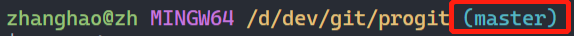

### Create tar that include changed file

```sh
git diff commitid HEAD --name-only | xargs -i echo '"{}"' | xargs tar zcf xxx.tar.gz
or
git diff commitid HEAD --name-only -z | xargs -0 tar zcf xxx.tar.gz
```

### How to upgrade git version

- install dependencies

  ```yum install -y curl-devel expat-devel gettext-devel openssl-devel zlib-devel asciidoc xmlto perl-devel perl-CPAN autoconf*```

- download git

  ```wget https://github.com/git/git/archive/xxxxxxxxxx.tar.gz```

- install

  ```sh
  tar zxf v-xxxxx.tar.gz
  cd git-xxxx
  make configure
  ./configure --prefix=/usr/local/git --with-iconv=/usr/local/libiconv
  make && make install
  echo "export PATH=$PATH:/usr/local/git/bin" >> /etc/bashrc
  ```

### Difference between tow-dot and three-dot

两个点和三个点在log和diff命令中有不同的含义

- log
  - tow-dots(..)

    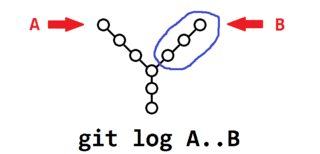

  - three-dots(...)

    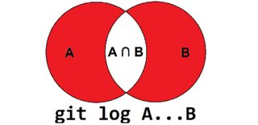

- diff & log

  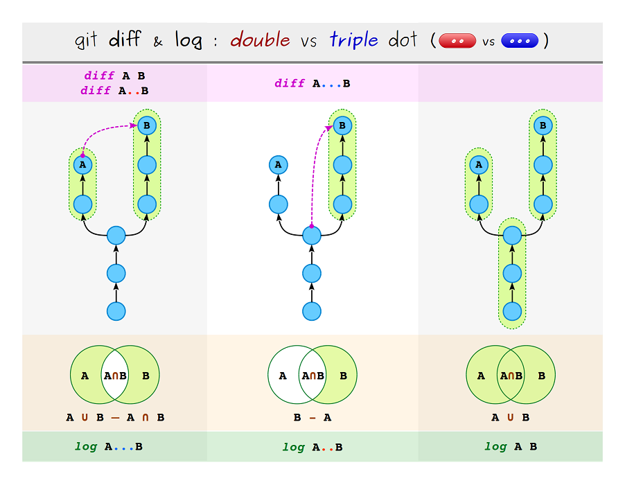

  举例：

  - log

    ```text
    A0 <- A1 <- A2 <- A3 (master)
      \
        C0 <- C1 (test)
    ```

    ```sh
    $ git log master..test
    # output C0 C1

    $ git log ^master test
    # output C0 C1

    $ git log master…test
    # output A1 A2 A3 C0 C1
    ```

    origin..HEAD: What did I do since I forked from the origin branch?

    HEAD..origin: What did the origin do since I forked from them?

  - diff

    ```sh
    git diff topic master or git diff topic..master
    will show the differences between the topic and master branch at that point in time

    git diff topic...master
    this will show all the differences between when the topic was made from the branch and after
    ```

### back to future

git具备时光穿梭机的功能，既可以回退，也可以在回退之后再返回之前的状态，我们叫做回到未来。reflog+reset的组合就可以实现回到未来的功能。

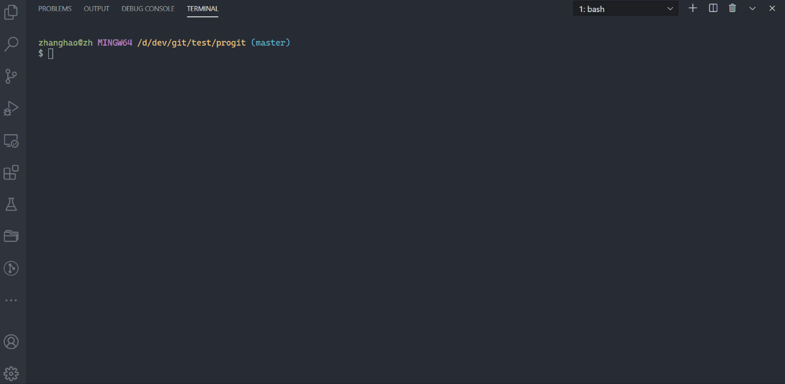

### pathspec

"git ls-files", "git ls-tree", "git add", "git grep", "git diff", "git checkout"等命令都会使用pathsepc参数，由于涉及到shell和git谁先解释该参数，在使用上要特别注意

- shell解释

  pathspec不要加引号修饰，比如说```git add *.txt```这时shell先进行*的展开，也就是当前目录下的以txt结尾的文件

- git解释
  - 加引号

    ```git add './*.txt'```，这样就将*解释成当前目录已经子目录，进行递归

  - 不加引号

    ```git add ./\*.txt```，将*进行转义，避免shell解释，交给git进行解释

- 使用
  - File or directory

    ```sh
    git add .           # add CWD(current working directory)
    git add src/        # add src/ directory
    git add README      # add only README file or directory
    git add src/ dest/  # add both src/ and dest/ directories
    ```

    在命令帮助中，我们可以看到标准形式为```command [options] [--] <pathspec>```，其中'--'是linux中为了避免模糊给出的一种解决方案

  - 通配符(wildcards)

    ```sh
    git log '*.js' # logs all .js files in CWD and subdirectories
    git log '.*'   # logs all 'hidden' files and directories in CWD
    git log '*/.*' # logs all 'hidden' files and directories in subdirectorie
    ```

    ```sh
    # example directory structure
    #
    # .
    # ├── package-lock.json
    # ├── package.json
    # └── data
    #     ├── bar.json
    #     ├── baz.json
    #     └── foo.json
    ```

    shell先解释

    ```sh
    git ls-files *.json

    # package-lock.json
    # package.json
    ```

    git先解释

    ```sh
    git ls-files '*.json'

    # data/bar.json
    # data/baz.json
    # data/foo.json
    # package-lock.json
    # package.json
    ```

  - magic signatures(魔力签名)
    - top

      top签名告诉git从仓库的根目录开始检索，而不是当前目录

      ```sh
      git ls-files ':(top)*.js'
      git ls-files ':/*.js' # shorthand
      ```

    - icase

      icase签名告诉git匹配的时候不要关注大小写

      ```sh
      git ls-files ':(icase)*.jpg'
      ```

    - literal

      literal签名告诉git所有的字符都是普通字符，特别是针对通配符想还原它的本义的时候

      ```sh
      git log ':(literal)*.js' # returns log for the file '*.js'
      ```

    - glob
      - **/

        A leading "**" followed by a slash means match in all directories
      - xx/**/xx

        A slash followed by two consecutive asterisks then a slash matches zero or more directories
      - /**

        A trailing "/**" matches everything inside

      ```sh
      git ls-files ':(glob)src/components/**/*.jsx' # ** can match zero or more directories
      ```

    - exclude(shorthand of :! or :^)

      exluce签名可以再检索结果中排除掉你指定的文件

      ```sh
      git grep 'foo' -- '*.js' ':(exclude)*.spec.js' # search .js files excluding .spec.js
      git grep 'foo' -- '*.js' ':!*.spec.js' .       # shorthand for the same
      ```

    - combining signatures

      我们可以联合使用魔力签名

      ```sh
      git ls-files -- ':(top,icase,glob,:!vendored)src/components/*/*.jsx'
      ```

### Ignore file

- github ignore project

  [ignore](https://github.com/github/gitignore)

- 忘记先生成ignore文件，并产生提交

  比如说：把gz文件也add到index中

  ```sh
  git rm -r --cached .    //r:递归 --cached：删除index
  create ingore file
  git add .
  ```

### git commit lint

通过commitlint和husky两个组件上线commit的message hook

执行以下语句

```sh
# cd project directory
# make sure your nodejs version >= 10

npm install -D @commitlint/{config-angular,cli} husky
echo "module.exports = {extends: ['@commitlint/config-angular']};" > commitlint.config.js
cat >>.huskyrc<<EOF
{
  "hooks": {
    "commit-msg": "commitlint -E HUSKY_GIT_PARAMS"
  }
}
EOF
```

commitlint规则：

#### type-enum

- **condition**: `type` is found in value
- **rule**: `always`
- **value**

```sh
  [
    'build',
    'ci',
    'docs',
    'feat',
    'fix',
    'perf',
    'refactor',
    'revert',
    'style',
    'test'
  ]
```

```sh
echo "foo: some message" # fails
echo "fix: some message" # passes
```

#### type-case

- **description**: `type` is in case `value`
- **rule**: `always`
- **value**

  ```sh
    'lowerCase'
  ```

```sh
echo "FIX: some message" # fails
echo "fix: some message" # passes
```

#### type-empty

- **condition**: `type` is empty
- **rule**: `never`

```sh
echo ": some message"     # fails
echo "fix: some message"  # passes
```

#### scope-case

- **condition**: `scope` is in case `value`
- **rule**: `always`

```sh
'lowerCase'
```

```sh
echo "fix(SCOPE): some message" # fails
echo "fix(scope): some message" # passes
```

#### subject-case

- **condition**: `subject` is in one of the cases `['sentence-case', 'start-case', 'pascal-case', 'upper-case']`
- **rule**: `never`

```sh
echo "fix(SCOPE): Some message"   # fails
echo "fix(SCOPE): Some Message"   # fails
echo "fix(SCOPE): SomeMessage"    # fails
echo "fix(SCOPE): SOMEMESSAGE"    # fails
echo "fix(scope): some message"   # passes
echo "fix(scope): some Message"   # passes
```

#### subject-empty

- **condition**: `subject` is empty
- **rule**: `never`

```sh
echo "fix:"               # fails
echo "fix: some message"  # passes
```

#### subject-full-stop

- **condition**: `subject` ends with `value`
- **rule**: `never`
- **value**

```sh
'.'
```

```sh
echo "fix: some message." # fails
echo "fix: some message"  # passes
```

#### header-max-length

- **condition**: `header` has `value` or less characters
- **rule**: `always`
- **value**

```sh
72
```

```sh
echo "fix: some message that is way too long and breaks the line max-length by several characters" # fails
echo "fix: some message" # passes
```

### Warnings

The following rules are considered warnings for `@commitlint/config-angular` and will print warning messages when not met.

#### body-leading-blank

- **condition**: Body begins with blank line
- **rule**: `always`

### changelog

利用conventional-changelog-cli组件实现changelog的自动编写

```sh
npm install -g conventional-changelog-cli
# cd project directory
npm init
```

edit package.json

```json
  "scripts": {
    "genlog": "conventional-changelog -p angular -i CHANGELOG.md -s"
  }
```

important options: conventional-changelog --help

```text
  Options
    -i, --infile              Read the CHANGELOG from this file
    -o, --outfile             Write the CHANGELOG to this file
    -s, --same-file           Outputting to the infile so you don't need to specify the same file as outfile
    -p, --preset              Name of the preset you want to use. Must be one of the following:
                              angular, atom, codemirror, ember, eslint, express, jquery, jscs or jshint
    -r, --release-count       How many releases to be generated from the latest
                              If 0, the whole changelog will be regenerated and the outfile will be overwritten
                              Default: 1
    -u, --output-unreleased   Output unreleased changelog
```

#### changelog workflow

- make changes
- commit those changes
- make sure CI to pass
- upgrade package.json(version: "x.x.x")
- run command: `npm run genlog` or `conventional-changelog -p angular -i CHANGELOG.md -s ...`
- git commit --amend(commit package.json and CHANGELOG.md)
- git push
- git tag vX.X.X
- git push origin vX.X.X

### Command cheat


