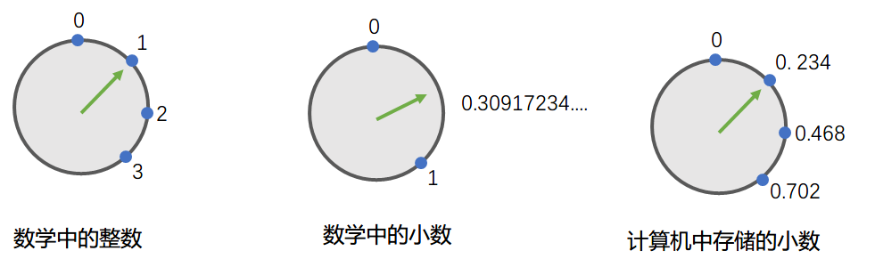
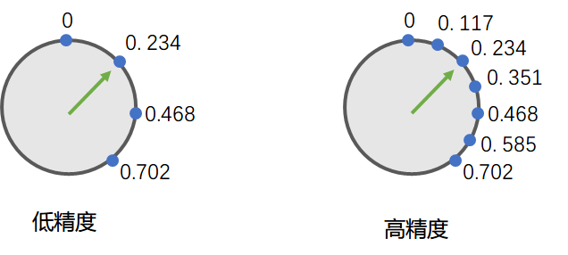
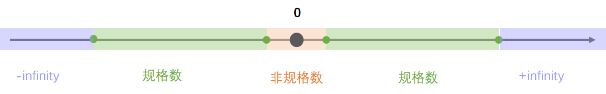
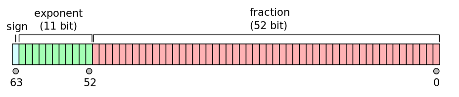
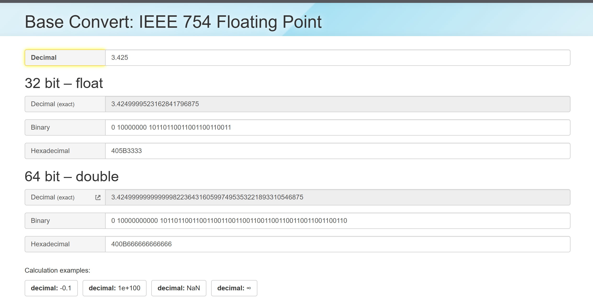

# 浮点数的一些知识

**By HZ**

| 版本 | 备注                                                         |    日期    |
| :--: | ------------------------------------------------------------ | :--------: |
| 1.0  | 初始版本                                                     | 2020/11/8  |
| 1.1  | 重构文档结构和内容<br />1. 增加问题章节<br />2. 对浮点数相关概念进行完善<br />3. 对文档逻辑结构进行调整 | 2024/12/30 |

## 1. 问题

1. 对于以下Java代码，输出结果是什么？

   ```java
       float sum = 0.0f;
       for (int i = 0; i < 1000000; i++) {
           sum += 0.1f;
       }
       System.out.printf("sum:%.3f\n", sum);
   ```

2. 同样遵守IEEE 754浮点数标准，Java和C++输出结果是否相同？

   ```c++
       //C++
       double var = 3.425;
       printf("var=%.16f\n", var);
       //Java
       double var = 3.425;
       System.out.printf("var=%.16f\n", var);
   ```

3. 数据库（Oracle）中存储的数值为**932.525**，在C++的客户端，保留两位小数显示为**932.52**，在基于Java后端，Javascript前端的Web应用中，保留两位小数后显示**932.53**，谁显示的是对的？

4. 不同的语言，如果涉及到互相调用，浮点型参数传递时，应该如何处理？

5. Java语言中，为什么BigDecimal就可以表达任意的有效数字，任意的范围？

6. 为什么要有非规约化数字？

## 2. IEEE 754简介

### 2.1. 科学计数法

十进制的科学技术法通常用一个数字乘以10的n次方来表示，形如$$a*10^n$$

- $$57.34=5.734*10^2$$
- $$0.03424=3.424*10^{-2}$$

二进制的规约化表达方式和科学计数法类似，形如$(-1)^{sign}\times1.b_1b_2...b_n*2^e$

### 2.2. **有效位数 vs 精度**

两个相关但是不完全相同的概念，在IEEE 754中

1. **有效位数（Significant Digits）**

   有效位数指的是数值中从最高有效位（不为零的第一位）到最后一位的总位数，用于衡量一个数值的**表示范围内的信息量**

   * 数值 `1.234` 有 4 位有效数字
   * 数值 `1.234 × 10³` 有 4 位有效数字
   * 数值 `0.00123` 有 3 位有效数字（前导零不算有效位数）

   

   ```c++
       float f1 = 1024.0009765625;
       float f2 = 1024.0009765624;
       float f3 = 1125899906842624;
       float f4 = 1125899906942624;
   	// 好像有效数字有17位
       printf("%.17f\n%.17f\n%.17f\n%.17f\n", f1, f2, f3, f4);
   
       float f5 = 1024.001;
       float f6 = 1024.002;
   	// 好像有效数字不足7位
       printf("%.17f\n%.17f\n", f5, f6);
   
   	result:
   	----------------
       1024.00097656250000000
       1024.00097656250000000
       1125899906842624.00000000000000000
       1125899906842624.00000000000000000
           
       1024.00097656250000000
       1024.00195312500000000
   ```

   

2. **精度（Precision）**

   **精度**在 IEEE 754 中是一个更广泛的概念，指的是浮点数表示值的**分辨能力**，即能够区分两个相邻数值的能力，同时也表达数字的范围
   
   
   
   
   
   ↑ 数学中的整数是一个一个的，想象绿色指针必须一次走一格
   
   ↑ 数学中的小数是连续的，想象绿色指针可以无极调节， 想走到哪儿走到哪儿
   
   ↑ 计算机中存储的小数是一个一个的，绿色指针必须一次走一格，就像整数那样
   
   
   
   这就引发了精度的问题，比如上图中，我们无法在计算机中存储0.3，因为绿色指针只能一次走一格，要么在0.234，要么就到了0.468...。当然，我们也可以增加计算机存储小数的精度，或者说缩小点与点之间的间隔。
   
   
   
   
   
   浮点数在计算机内部存储，间隔并不是等距的，类似与下面的图形，越小的数据，间隔也越小，越大的数	字，间隔也越大。
   
   
   
   ```c++
   	float f1 = 16777215;
   	// 16777216是临界点，它之前，间隔是1，它之后，间隔是2
   	float f2 = 16777216;
   	float f3 = 16777217;
   	float f4 = 16777218;
   	printf("%f\n%f\n%f\n%f\n", f1, f2, f3, f4);
   
   	result:
   	-------------
       16777215.000000
       16777216.000000
       16777216.000000
       16777218.000000
   ```

### 2.3. 浮点型存储结构

在计算机中，浮点数也利用科学计数法来表达，但是计算机使用二进制，所以就采用二进制的科学计数法来表达。浮点数（双精度64位）存储结构：



浮点数是由三部分组成，分别是符号位（sign）、指数位（exponent）、尾数（mantissa/fraction）

- **Sign bit: 1 bit**

  符号位决定了数字是正数还是负数，**二进制0代表正数，1代表负数**

- **Exponent: 11 bit**

  指数是由11位组成，代表$$[0,2047]$$（$$2047=2^{11}-1$$）。参考十进制小数的科学计数法（比如说$$3.2×10^{-2}$$），二进制为了表达小数，指数也需要支持负数，通过二进制偏移量方法，可以做到这一点。讲解偏移量方法之前，
  
  我们用一个例子来说明这一点。如果有一个类别的浮点数用4位来表达指数（假想的例子，应该没有这个类别），那么指数的范围为$$e\in[0,2^4-1]$$，已知偏移量公式为$$2^{n-1}-1$$，因此偏移量为7。
  
  偏移量方法要解决的问题是能够表达负指数，同时让正负指数分布范围均等，因此我们让每一个原始的指数都减去偏移量7，这样原本$$[0,15]$$的表达范围变成了$$[-7,8]$$。
  
  
  
  > [!TIP]
  >
  > 关于偏移量，针对不同精度浮点数，偏移量如下
  >
  > * **半精度浮点数：**偏移量=$2^{5-1}-1=15$
  >
  > * **单精度浮点数：**偏移量=$2^{8-1}-1=127$
  >
  > * **双精度浮点数：**偏移量=$$2^{11-1}-1=1023$$
  >
  >   > [!tip]
  >   >
  >   > 半精度指数位使用5位，单精度指数位使用8位，双精度指数位使用11位
  
  
  
  回到双精度浮点数的偏移量，根据公式计算结果，$e\in[2^{0-1023}, 2^{2047-1023}]=e\in[2^{-1023},2^{1024}]$，但是`-1023,1024`是两个特殊的值，`-1023`代表非规格化数据（非规格化数用于表示非常接近于零的数）,`1024`代表负无穷或者正无穷（正负靠符号位决定）。另外，指数位和尾数位如果全为0，则代表数字0（符号位不同区分正0和负0）。综上所述，双精度的指数范围为$e\in[2^{-1022}, 2^{1023}]$，这个指数范围对应到十进制为$e\in[10^{-308}, 10^{308}]$。
  
  
  
  > [!TIP]
  >
  > 为什么是10的308次方呢？
  >
  > $10^x\approx2^{1023}=>x\approx 1023 \times log_{10}^2=>x\approx 308$
  
  
  
  **偏移量方法**
  
  首先说明下面表格各个列的含义：
  
  * **存储指数：**浮点数在二进制存储结构中，存储的二进制所代表的十进制值
  
  * **存储指数二进制：**浮点数在二进制存储结构中，存储的二进制
  
  * **实际指数：**通过偏移量方法计算后的十进制数值
  
  * **实际指数二进制（补码形式）：**通过偏移量方法计算后的二进制数值（补码形式，Two's complement）
  
    | 存储指数 | 存储指数二进制 | 实际指数 | 实际指数二进制（Two's complement） |
    | :------: | :------------: | :------: | :--------------------------------: |
    |    15    |      1111      |    8     |                1000                |
    |    14    |      1110      |    7     |                0111                |
    |    13    |      1101      |    6     |                0110                |
    |    12    |      1100      |    5     |                0101                |
    |    11    |      1011      |    4     |                0100                |
    |    10    |      1010      |    3     |                0011                |
    |    9     |      1001      |    2     |                0010                |
    |    8     |      1000      |    1     |                0001                |
    |    7     |      0111      |    0     |                0000                |
    |    6     |      0110      |    −1    |                1111                |
    |    5     |      0101      |    −2    |                1110                |
    |    4     |      0100      |    −3    |                1101                |
    |    3     |      0011      |    −4    |                1100                |
    |    2     |      0010      |    −5    |                1011                |
    |    1     |      0001      |    −6    |                1010                |
    |    0     |      0000      |    −7    |                1001                |


- **Mantissa: 53 bit (52 explicitly stored)**

  二进制的规约化表达方式要求第一位非零，二进制非0及1，因此，二进制的规约化表达方式是<font color='RED'>$1.b_1b_2...b_n*2^e$</font>。为了扩大有效位数，第一位的1作为固定值（这一位是隐藏值，不需要占用存储位），因此有效位数从52变成53，也就是$b_n$中的n=53
  
  
  
  > [!TIP]
  >
  > double的有效位数为15到16位，为什么是15到16位有效数字？
  >
  > $10^x\approx 2^{53}=>x\approx 53\times log_{10}^2=>x\approx15.92$
  
  

结合以上知识，二进制浮点数表达方式可以有两种方式，分别是二进制方式和十进制方式。其中二进制表达方	式更偏向于存储结构；十进制表达偏向于人类的理解和应用程序输出。

- **二进制（Binary）**

  $(-1)^{sign}(1.b_{51}b_{50}b_{49}...b_0)_2\times2^{e-1023}$
- **十进制（Decimal）**

  $(-1)^{sign}\left(1+\sum_{i=1}^{52}b_{52-i}\times2^{-i}\right)\times2^{e-1023}$


我们通过一些例子进一步加深理解，首先我们看一个半精度浮点数的计算过程：


> [!TIP]
>
> 等比数列的求和公式
>
> $S_n=a_1\times\frac{1−r^n}{1-r}$
>
> 其中
>
> * $a_1$：数列的第一项
> * r：公比
> * n：项数

* $0\ 01111111111\ 0000000000000000000000000000000000000000000000000000_2=2^{1023-1023}\times (1+0)=2^0\times 1 = 1$

* $0\ 01111111111\ 0000000000000000000000000000000000000000000000000001_2=2^{1023-1023}\times (1+2^{-52}) \approx 1.0000000000000002$

* $0\ 01111111111\ 0000000000000000000000000000000000000000000000000010_2=2^{1023-1023} \times (1 + 2^{-51}) \approx 1.0000000000000004$

* $1\ 10000000000\ 0000000000000000000000000000000000000000000000000000_2=-2^{1024-1023} \times (1 + 0) = -2$

* $0\ 10000000000\ 1000000000000000000000000000000000000000000000000000_2=2^{1024-1023} \times (1 + 1 \times 2^{-1})=2\times1.5=3$

> [!TIP]
>
> 我们也可以采用移位方法实现二进制->十进制的转化
>
> $2^{1024-1023} \times 1.1_2=2^1 \times 1.1_2 = 11_2 =3$
>
> 二进制乘以2，就好比十进制乘以10，所以$1.1_2\times2^1=11_2=3$


* $0\ 10000000011\ 0111000000000000000000000000000000000000000000000000_2=2^{1027-1023} \times 1.0111_2 = 2^4 \times 1.0111 = 10111_2=2^4+2^2+2^1+2^0=23$

* $0\ 01111111000\ 1000000000000000000000000000000000000000000000000000_2=2^{1016-1023} \times 1.1_2 = 2^{-7} \times 1.1_2 = 0.00000011_2=1 \times 2^{-7} + 1 \times 2^{-8} = \frac{3}{2^8} = 0.01171875$

  

> [!IMPORTANT]
>
> 特殊的数字
>
> * **最小正整数**
>
>   $0\ 00000000001\ 0000000000000000000000000000000000000000000000000000_2=2^{1-1023} \times 1 \approx 2.225 \times 10^{-308}$
>
> * **最大正整数**
>
>   $0\ 11111111110\ 1111111111111111111111111111111111111111111111111111_2=2^{2046-1023} \times (1 + (1 - 2^{-52})) \approx 1.798 \times 10^{308}$
>
>   其中，尾数部分有一部分是$1-2^{-52}$，因为是等比数量求和，可以直接按照公式计算获得
>
>   $2^{-1} + 2^{-2} + ... + 2^{-52} = 2^{-1} \times \left(\frac{1-(2^{-1})^{52}}{1-2^{-1}}\right) =1-2^{-52}$
>
> * **+$\infty$**
>
>   $0\ 11111111111\ 0000000000000000000000000000000000000000000000000000_2=7FF0 0000 0000 0000_{16}=+\infty$
>
> * **-$\infty$**
>
>   $1\ 11111111111\ 0000000000000000000000000000000000000000000000000000_2=FFF0 0000 0000 0000_{16}=-\infty$
>
> * **NaN**（尾数位不全为0的即可，也就是7FFF 0000 0000 0000也是NaN）
>
>   $0\ 11111111111\ 1111111111111111111111111111111111111111111111111111_2=7FFF FFFF FFFF FFFF_{16}=NaN$
>
> * **非规约化数字**
>
>   对于双精度浮点型来说，指数位全部为0，尾数第一位必须为1，表达式为$(-1)^{sign}\times2^{-1022}\times0.b_1b_2..b_52$，偏移量方法约定实际指数e=E - 1023，但是754标准约定，实际指数同样为-1022，保持和规约化最小指数一致。

## 3. 回答问题

1. 对于以下Java代码，输出结果是什么？

   ```java
       float sum = 0.0f;
       for (int i = 0; i < 1000000; i++) {
           sum += 0.1f;
       }
       System.out.printf("sum:%.3f\n", sum);
   
       result
       -----------------
       sum:100958.344
   ```

   对于单精度浮点数0.1，其实计算机并没有办法准确的表达，其二进制表示为`0 01111011 10011001100110011001101`，其对应的十进制数为`0.100000001490116119384765625`，经过100w次累计加法，误差被呈现出来，而且误差很大。

   
   
   > [!TIP]
   >
   > 十进制浮点数0.1如何转化为二进制进行存储？
   >
   > 对于十进制数，转换为二进制小数采用 “乘取整” 的方法。
   >$$
   > 0.1\times2=0.2\quad整数部分为0\\
   > 0.2\times2=0.4\quad整数部分为0\\
   > 0.4\times2=0.8\quad整数部分为0\\
   > 0.8\times2=1.6\quad整数部分为1\\
   > 0.6\times2=1.2\quad整数部分为1\\
   > ...
   > $$
   > 所以$0.1_{10}$转化为二进制是$0.000110011001100...$，它是一个无限循环二进制小数，写成二进制规格化形式为$1.10011001100...\times2^{-4}$
   > 
   > 接下来确定符号位、指数位、尾数
   > 
   >1. 符号位：因为是整数，所以符号位是0
   > 
   >2. 指数位：8位，`-4`是经过偏移量法转化之后的指数，也就是减去`127`的结果，那么原始的指数为`123`,其二进制为$01111011_2$
   > 
   >3. 尾数：23位，也就是$1.10011001100_2...$小数点后的23位，即100 1100 1100 1100 1100 1100 **1**
   > 
   >  > [!IMPORTANT]
   >    >
   >    > 最后面加粗的1是第24位，因为只能保留23位，在第23位上要根据24位进行四舍五入
   > 
   > 所以$0.1_{10}$的二进制表达是$0\quad01111011\quad100\quad1100\quad1100\quad 1100\quad1100\quad1101$
   
2. 同样遵守IEEE 754浮点数标准，Java和C++输出结果是否相同？

   ```java
       //C++
       double var = 3.425;
       printf("var=%.16f\n", var);
   
       result
       ____________________
       var=3.4249999999999998
   
       //Java
       double var = 3.425;
       System.out.printf("var=%.16f\n", var);
   
       result
       ____________________
       var=3.4250000000000000
           
       //Java
       System.out.println(new BigDecimal(var).toPlainString())
       //3.42499999999999982236431605997495353221893310546875
   ```

     

​		这个问题的答案源自C++和Java的输出策略，也就是C++选择遵循原始数据值，而Java选择了遵循人类易于		理解的结果。

3. 数据库（Oracle）中存储的数值为**932.525**，在C++的客户端，保留两位小数显示为**932.52**，在基于Java后端，Javascript前端的Web应用中，保留两位小数后显示**932.53**，谁显示的是对的？

   932.525这个浮点数用二进制表达分两部分，分别是整数部分和小数部分：

   * 整数部分

     | 过程  |  商  | 余数 |
     | :---: | :--: | :--: |
     | 932/2 | 466  |  0   |
     | 466/2 | 233  |  0   |
     | 233/2 | 116  |  1   |
     | 116/2 |  58  |  0   |
     | 58/2  |  29  |  0   |
     | 29/2  |  14  |  1   |
     | 14/2  |  7   |  0   |
     |  7/2  |  3   |  1   |
     |  3/2  |  1   |  1   |
     |  1/2  |  0   |  1   |

     因此整数部分为余数从后向前的结果：`1110100100`

   * 小数部分

     |  过程   | 结果 | 整数部分 | 剩余小数 |
     | :-----: | :--: | :------: | :------: |
     | 0.525*2 | 1.05 |    1     |   0.05   |
     | 0.05*2  | 0.1  |    0     |   0.1    |
     |  0.1*2  | 0.2  |    0     | **0.2**  |
     |  0.2*2  | 0.4  |    0     |   0.4    |
     |  0.4*2  | 0.8  |    0     |   0.8    |
     |  0.8*2  | 1.6  |    1     |   0.6    |
     |  0.6*2  | 1.2  |    1     | **0.2**  |

     可以看出，从0.2开始循环，因此小数部分的二进制表达为`100 0011 0011 0011 0011...`

   * 整合结果

     `1110100100.1000011001100110011....`

     规格化（科学计数法）：$1.110100100\quad  100\quad 0011\quad 0011\quad 0011\quad 0011...\times2^{9}$

     对于64位单精度：

     * 符号位：0（1 bit）

     * 指数位：$1023+9=1032$，二进制`10000001000`（11 bit）

     * 尾数：110100100 100 **0011**001100110011001100110011001100110011（52 bit），$9+3+40=52$，按照循环节（0011），第53位是0，小于$0.5_{10}$，所以不会产生舍入。

       > [!TIP]
       >
       > 浮点数的舍入算法：
       >
       > * 十进制（四舍五入）
       >   * 假设我们要将一个数舍入到整数，对于数字 2.46=2.5，2.41=2.4。
       >
       > * 浮点数（舍入到最接近，平局采用Ties to Even（向偶数靠拢））
       >
       >   偶数靠拢：就是尾数的最低位如果是0就是偶数，尾数是1就是奇数。
       >
       >   * 先用十进制描述，如果保留2位有效数字，1.2349=1.23，1.2351=1.24，1.2350介于1.23和1.24之间，也就是平局，那么向偶数靠拢，也就是1.24。如果是1.2450，介于1.24和1.25之间，那么向偶数靠拢，就是1.24.
       >
       >   * 回到二进制，如果保留2位小数，1.10(11)，多余的11（二进制$0.11_2$，$0.75_{10}$）
       >
       >     * 当多余的数字正好是$0.5_{10}$，那么就会产生平局，说明在两个数中间，这个时候就需要向偶数靠拢。
       >
       >       10.11(100)：11.00，多余的数字0.100=0.5，向偶数靠拢
       >
       >       10.10(100)：10.10，多余的数字0.100=0.5，10.10已经为偶数
       >
       >     * 当后面多余的数字>0.5，则向上舍入
       >
       >       10.00(110)：10.01，多余的数字0.110>0.5
       >
       >     * 当后面多余的数字<0.5，则向下舍入
       >
       >       10.00(011)：10.00， 多余的数字0.011<0.5

     经过二进制转化，$932.525_{10}=0 110100100 100 0011001100110011001100110011001100110011_2$，这个二进制对应的十进制为`932.5249999999999772626324556767940521240234375`

   * **结论：**
     
     1. 因此C++的客户端按照小数点后保留2位有效数字，显示为`932.52`
     2. Java的后端用BigDecimal接932.525，可以精确的接收到这个参数，并进行小数位数的保留，再向前端传递，因此最终显示为`932.53`
     
     所以，无论是C++还是Java都没错，错在浮点数过于复杂😂

4. 不同的语言，如果涉及到互相调用，浮点型参数传递时，应该如何处理？

   1. Java调用C++：因为Java和C++的浮点型数据都遵守IEEE 754标准，因此可以通过JNI的方式，将Java中的float或者double直接传递给C++，两边可以保持很好的有效位数；另外一种方式可以采用传递字符串的方式，将数字参数传递过去，在C++端将字符串再转化为数字。
   2. Oracle调用C++：Oracle中的BINARY_FLOAT和BINARY_DOUBLE就是遵守IEEE 754标准的浮点型，对应与C++/Java的float和double，因此Oracle的存储过程调用外部程序（C++)时，涉及浮点型参数传递时，应该使用这两种类型，并且保证和接收端一致，也就是接收端的入参类型是double，Oracle的调用函数实参也应该是BINARY_DOUBLE类型。

5. Java语言中，为什么BigDecimal就可以表达任意的精度？

   `BigDecimal`是基于**任意精度的整数**（通过 `BigInteger`）和 **10的整数次幂** 来表示浮点数的。具体来说，`BigDecimal`使用了一个**整数部分**和一个**指数**来表示任意精度的小数。

   * **表示形式**：`BigDecimal` 使用一种类似于科学计数法的表示方式：$value=mantissa\times10^{exponent}$

     其中：

     * mantissa（尾数）是一个整数，表示实际数值的有效部分
     * exponent（指数）是一个整数，表示这个数值需要乘以 10 的多少次方，确定小数点的位置

     例如：

     `123.456` 可以表示为 $123456 × 10^{-3}$，这里 `123456` 是尾数（mantissa），`-3` 是指数（exponent）

   * 实现细节：
     * `BigDecimal` 的 **尾数（mantissa）** 使用 `BigInteger` 来表示。`BigInteger` 类提供了任意精度的整数表示，它可以处理比 `long` 类型更大的数，因此可以精确表示非常大的尾数。`BigInteger`用一个数组来表示整数的各个数字，因此它可以表示任意大的数字，仅仅受限于计算机的内存大小和计算机的计算能力
     * **指数（exponent）** 是一个普通的整数，表示数值的小数点的位置

6. 为什么要有非规约化数字？

   规约化规范要求，形式为$(-1)^{sign}\times2^{exponent}\times1.b_1b_2..b_n$，尾数位第一位必须是1，如果指数位都为0，也是规约化数字，对于双精度来说，大于0的最小的规约化数字就是$2^{-1022}\times(1+0)=2^{-1022}$，如果想表达更小的数字就无能为力了，但是非规约化很好的解决了这个问题，即可以表达更接近0的数字，同时也可以让贴近0的计算结果变得更平滑，不会出现突然下溢到0的问题。举例，一个非规约化的数字，$(-1)^0\times2^{-1022}\times0.10...0=2^{-1022}\times(0+2^{-1})=2^{-1023}$，这个值同最小规约化数字比起来，变得更小，更贴近0。

## 4. 最佳实践

1. 浮点型数据比较大小

   ```java
   if (Math.abs(var - 0.1f) < 0.00001) {
       // var == 0.1
   }
   ```

2. 装箱和拆箱

   **应该避免在大循环逻辑下，频繁的装箱和拆箱浮点型（float/double<->BigDecimal）**

3. 何时使用BigDecimal或者double

   * 对于性能要求不高的人机交互类应用，优先选择BigDecimal
   * 对于性能要求高的，应该考虑将浮点型转化为整型，回写数据库时再转化为浮点型
   * 在double有效位数满足业务需求的情况下，double依然是最佳实践，但是应避免随意混用double和BigDecimal，应用内尽量统一风格

4. 如何正确初始化BigDecimal

   ```java
   BigDecimal var = new BigDecimal("123.456");
   ```

5. 何时四舍五入

   * 如果累计计算需要更加准确的结果，应该在累计后四舍五入。比如说获取十条数据的波动率之和，sum之后再进行四舍五入更准确
   
   * 如果在表格控件中显示小计合计，由于每一条数据都进行了四舍五入，因此小计合计的计算，应该基于每一条四舍五入的结果进行累计
   
     **原始数据如下**：
   
     | MEMBER_ID | CLIENT_ID |  QTY   |
     | :-------: | :-------: | :----: |
     |   0011    |     X     | 10.345 |
     |   0011    |     Y     | 20.456 |
     |   0015    |     X     | 30.123 |
     |   0015    |     Y     | 40.789 |
   
     如果希望展示给前端的结果，每一条明细数据都要保留2位小数（四舍五入），可以用下面的分层汇总(rollup)语句
   
     ```sql
     SELECT
         CASE
             WHEN GROUPING(MEMBER_ID) = 1 THEN '总计'
             WHEN GROUPING(CLIENT_ID) = 1 THEN '小计'
             ELSE MEMBER_ID
         END AS MEMBER_ID,
         CLIENT_ID,
         SUM(qty) AS QTY_ORI,
         -- 要对逐条明细先进行保留2位小数的四舍五入动作
         -- 汇总的小计和合计的结果也是按照处理过的明细数据进行累计计算
         -- 如果不在sum里面添加round处理，那么明细和汇总保留了原始的有效位数（NUMBER类型）
         SUM(round(qty, 2)) AS QTY,
         GROUPING(MEMBER_ID) AS ORDER1,
         MEMBER_ID AS ORDER2,
         GROUPING(CLIENT_ID) AS ORDER3
     FROM test
     GROUP BY ROLLUP(MEMBER_ID, CLIENT_ID)
     ORDER BY ORDER1, ORDER2, ORDER3
     ```
   
     
   
     | MEMBER_ID | CLIENT_ID |   QTY_ORI   |    QTY     | ORDER1 | ORDER2 | ORDER3 |
     | :-------: | :-------: | :---------: | :--------: | :----: | :----: | :----: |
     |   0011    |     X     |   10.345    |   10.35    |   0    |  0011  |   0    |
     |   0011    |     Y     |   20.456    |   20.46    |   0    |  0011  |   0    |
     | **小计**  |   NULL    | **30.801**  | **30.81**  |   0    |  0011  |   1    |
     |   0015    |     X     |   30.123    |   30.12    |   0    |  0015  |   0    |
     |   0015    |     Y     |   40.789    |   40.79    |   0    |  0015  |   0    |
     | **小计**  |   NULL    |  **30.81**  | **70.91**  |   0    |  0015  |   1    |
     | **总计**  |   NULL    | **101.713** | **101.72** |   1    |  NULL  |   1    |
   
     

## 5. 参考信息

### 5.1. IEEE 754的由来

1985年，由IEEE协会发起编写，754代表本规范的编号。在此之前，浮点数的协议各异，给数据通信、应用人员造成很多困扰。

### 5.2. Java Double类中的常量

```java
public final class Double extends Number implements Comparable<Double> {
    /**
     * A constant holding the positive infinity of type
     * {@code double}. It is equal to the value returned by
     * {@code Double.longBitsToDouble(0x7ff0000000000000L)}.
     */
    public static final double POSITIVE_INFINITY = 1.0 / 0.0;

    /**
     * A constant holding the negative infinity of type
     * {@code double}. It is equal to the value returned by
     * {@code Double.longBitsToDouble(0xfff0000000000000L)}.
     */
    public static final double NEGATIVE_INFINITY = -1.0 / 0.0;

    /**
     * A constant holding a Not-a-Number (NaN) value of type
     * {@code double}. It is equivalent to the value returned by
     * {@code Double.longBitsToDouble(0x7ff8000000000000L)}.
     */
    public static final double NaN = 0.0d / 0.0;

    /**
     * A constant holding the largest positive finite value of type
     * {@code double},
     * (2-2<sup>-52</sup>)&middot;2<sup>1023</sup>.  It is equal to
     * the hexadecimal floating-point literal
     * {@code 0x1.fffffffffffffP+1023} and also equal to
     * {@code Double.longBitsToDouble(0x7fefffffffffffffL)}.
     */
    public static final double MAX_VALUE = 0x1.fffffffffffffP+1023; // 1.7976931348623157e+308

    /**
     * A constant holding the smallest positive normal value of type
     * {@code double}, 2<sup>-1022</sup>.  It is equal to the
     * hexadecimal floating-point literal {@code 0x1.0p-1022} and also
     * equal to {@code Double.longBitsToDouble(0x0010000000000000L)}.
     *
     * @since 1.6
     */
    public static final double MIN_NORMAL = 0x1.0p-1022; // 2.2250738585072014E-308

    /**
     * A constant holding the smallest positive nonzero value of type
     * {@code double}, 2<sup>-1074</sup>. It is equal to the
     * hexadecimal floating-point literal
     * {@code 0x0.0000000000001P-1022} and also equal to
     * {@code Double.longBitsToDouble(0x1L)}.
     */
    public static final double MIN_VALUE = 0x0.0000000000001P-1022; // 4.9e-324

    /**
     * Maximum exponent a finite {@code double} variable may have.
     * It is equal to the value returned by
     * {@code Math.getExponent(Double.MAX_VALUE)}.
     *
     * @since 1.6
     */
    public static final int MAX_EXPONENT = 1023;

    /**
     * Minimum exponent a normalized {@code double} variable may
     * have.  It is equal to the value returned by
     * {@code Math.getExponent(Double.MIN_NORMAL)}.
     *
     * @since 1.6
     */
    public static final int MIN_EXPONENT = -1022;

    /**
     * The number of bits used to represent a {@code double} value.
     *
     * @since 1.5
     */
    public static final int SIZE = 64;
    
    ....
}
```

### 5.3. 参考文档

1. [Base Convert: IEEE 754 Floating Point](https://baseconvert.com/ieee-754-floating-point)
3. [IEEE 754 - 维基百科，自由的百科全书 (wikipedia.org)](https://zh.wikipedia.org/zh-hans/IEEE_754)

