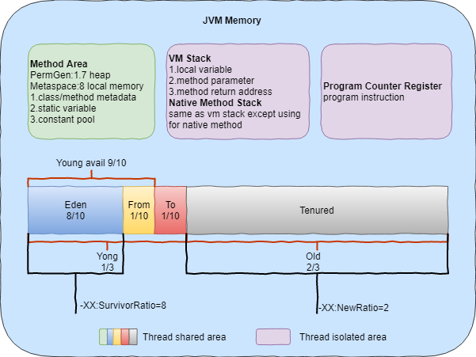
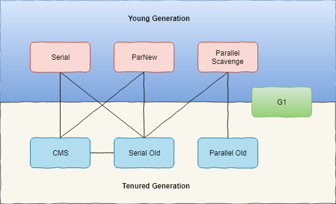

# Maintenance command tutorails

- [Maintenance command tutorails](#maintenance-command-tutorails)
  - [Goal](#goal)
  - [Commands](#commands)
    - [CPU](#cpu)
      - [top](#top)
    - [Disk](#disk)
      - [df](#df)
      - [du](#du)
      - [ls/ll](#lsll)
    - [Network](#network)
      - [sar](#sar)
    - [IO](#io)
      - [iostat](#iostat)
    - [Memory](#memory)
      - [free](#free)
    - [JVM](#jvm)
      - [JVM Memory](#jvm-memory)
      - [jps](#jps)
      - [jmap](#jmap)
      - [jstat](#jstat)
      - [jstack](#jstack)
      - [jhat](#jhat)
      - [jinfo](#jinfo)
    - [Port](#port)
      - [netstat](#netstat)
      - [lsof](#lsof)
    - [Dubug](#dubug)
      - [jdb](#jdb)
  - [Arthas](#arthas)

## Goal

- 如何在linux上进行问题分析
- java命令及工具的初步了解和掌握
- 运维流程标准化专业化

## Commands

### CPU

#### top

- Description：top程序提供了运行系统的动态实时视图。它可以显示系统摘要信息以及当前由Linux内核管理的进程或线程列表。
- Synopsis
  - top -hv|-bcHiOSs -d secs -n max -u|U user -p pid -o fld -w [cols]
- Command-line options || Interactive command
  - 1：显示所有cpu信息
  - U|u user：过滤对应的程序
  - M：内存使用率倒序查看
  - P：Cpu使用率倒序查看
  - H：线程显示
  - E：扩展模式显示summary的内存数据
  - e：扩展模式显示task window的内存数据
  - k：kill signal(15, 9)
  - L：搜索关键字 - &：find next
  - f：添加field, d|space->q|esc
  - p：启动参数，监控对一个的pid进程
- Pay Attention to
  - load average：1min 5min 15min
  - Mem：free+buff+cache, see also free(1)
  - RES：Resident Memory Size，某一个正在运行的进程使用的非交换区的物理内存大小

### Disk

#### df

- Description：report file system disk space usage
- Synposis：df [OPTION]... [FILE]...
- Command line options
  - h：human
  - T：show type
- Pay Attension to：
  - 查询某个目录mount on在哪里？df -h /home/dce

#### du

- Description： estimate file space usage
- Synposis：df [OPTION]... [FILE]...
- Command line options
  - h：human
  - s：summarize
- Pay Attension to：none

#### ls/ll

- h：human

### Network

#### sar

- Description： Collect, report, or save system activity information
- Synposis：man sar
- Command line options
  - d：report activity for each block device, see also iostat
  - n：report network statistics
- Pratice
  - wget https://github.com/apache/flink/archive/release-1.8.1-rc1.tar.gz
  - sar -n DEV 2

### IO

#### iostat

- Description：Report Central Processing Unit (CPU) statistics and input/output statistics for devices and partitions
- Synposis：man iostat
- Command line options
  - h：human
  - p：displays statistics for block devices
  - x：display extended statistics
  - m：megabyte
- Pratice
  - dd if=/dev/zero of=test bs=1k count=1024000
  - fio -filename=./test -direct=1 -iodepth 1 -rw=randwrite -ioengine=libaio -bs=16k -size=2G -numjobs=1 -runtime=60 -group_reporting -name=mytest
  - iostat -p -h -x 1
- Pay attension to
  - avgqu-sz：发送到设备上的io请求的平均队列长度
  - r_await：设备可以处理读请求的平均时间（毫秒）
  - w_await：设备可以处理写请求的平均时间（毫秒）
  - %util：Percentage of elapsed time during which I/O requests were issued to the device (bandwidth utilization for the  device). Device saturation occurs when this value is close to 100%

### Memory

#### free

- Description：Display amount of free and used memory in the system
- Synposis：free [OPTION]
- Command line options
  - h：human
- Pay Attension to：
  - remain = free+buff/cache

### JVM

#### JVM Memory

- JVM Memory Anatomy

- JVM Memory Management
  - Eden
  - Survivor
    - from
    - to
  - Tenured
  - Metaspace
- GC Collection

  |        Parameter        |          Description           |
  | :---------------------: | :----------------------------: |
  |    -XX:+UseSerialGC     |       Serial+Serial Old        |
  |    -XX:+UseParNewGC     |       ParNew+Serial Old        |
  | -XX:+UseConcMarkSweepGC |  ParNew+CMS Serial Old backup  |
  |   -XX:+UseParallelGC    |  Parallel Scavenge+Serial Old  |
  | -XX:+UseParalledlOldGC  | Parallel Scavenge+Parallel Old |
  |      -XX:+UseG1GC       |         java1.7 java8          |

- JVM Memory Parameter

  - -X：非所有JVM支持
  - -XX：非稳定选项

  |            Parameter            |        Description         |
  | :-----------------------------: | :------------------------: |
  |              -Xmx               |       max heap space       |
  |              -Xms               |       min heap space       |
  |              -Xmn               |        young space         |
  |              -Xss               |        stack space         |
  |           -verbose:gc           |        print gc log        |
  |       -XX:+PrintGCDetails       |    print detail gc log     |
  |       -XX:+PrintHeapAtGC        | print gc log when gc occur |
  |       -Xloggc:log/gc.log        |      config log path       |
  | -XX:+HeapDumpOnOutOfMemoryError | create dump file when oom  |
  |     -XX:+HeapDumpPath=XXXX      |   config dump file path    |

- Java Type Information

  |       Alias        |   Type    |
  | :----------------: | :-------: |
  |         B          |   Byte    |
  |         C          |   Char    |
  |         D          |  Double   |
  |         F          |   Float   |
  |         I          |  Integer  |
  |         J          |   Long    |
  |         Z          |  Boolean  |
  |         S          |   Short   |
  |         [I         | Integer[] |
  | Ljava/lang/String; |  String   |

#### jps

- Description：Lists the instrumented Java Virtual Machines (JVMs) on the target system
- Synposis：jps [ options ] [ hostid ]
- Command line
  - m：显示main函数的参数
- Pay attention to：none

#### jmap

- Description：Prints shared object memory maps or heap memory details for a process, core file, or remote debug server
- Synposis：jmap [ options ] pid
- Command line
  - heap：显示堆内存的垃圾回收信息
  - histo[:live]：堆的直方图
  - dump：输出dump文件，可以被jhat使用
- Practice
  - jmap -histo pid
  - jmap -heap pid
  - jmap -dump:format=b,file=\<out\> pid
- Pay attention to：none
  - java8之后取消永久代，增加Metaspace区域
  - java9之后默认的GC为G1

#### jstat

- Description：monitors Java Virtual Machine (JVM) statistics
- Synposis：jstat [ generalOption | outputOptions vmid [ interval[s|ms] [ count ] ]
- Command line：
  - outputOptions
    - class：显示ClassLoad的相关信息；
    - compiler：显示JIT编译的相关信息；
    - gc；显示和gc相关的堆信息；
    - gccapacity：显示各个代的容量以及使用情况；
    - gcmetacapacity：显示metaspace的大小
    - gcnew：显示新生代信息；
    - gcnewcapacity：显示新生代大小和使用情况；
    - gcold：显示老年代和永久代的信息；
    - gcoldcapacity：显示老年代的大小；
    - gcutil：显示垃圾收集信息；
    - gccause：显示垃圾回收的相关信息（通-gcutil）,同时显示最后一次或当前正在发生的垃圾回收的诱因；
    -printcompilation：输出JIT编译的方法信息；
  - vmid：pid
  - interval：时间间隔(s|ms)
  - count：重复几次
- Pay attention to：

| Field |                     Description                      |
| :---: | :--------------------------------------------------: |
|  S0C  |        Current survivor space 0 capacity (kB)        |
|  S0C  |        Current survivor space 0 capacity (kB)        |
|  S1C  |        Current survivor space 1 capacity (kB)        |
|  S0U  |          Survivor space 0 utilization (kB)           |
|  S1U  |          Survivor space 1 utilization (kB)           |
|  EC   |           Current eden space capacity (kB)           |
|  EU   |             Eden space utilization (kB)              |
|  OC   |           Current old space capacity (kB)            |
|  OU   |              Old space utilization (kB)              |
|  MC   |               Metaspace capacity (kB)                |
|  MU   |             Metacspace utilization (kB)              |
| CCSC  |         Compressed class space capacity (kB)         |
| CCSU  |           Compressed class space used (kB)           |
|  YGC  | Number of young generation garbage collection events |
| YGCT  |       Young generation garbage collection time       |
|  FGC  |               Number of full GC events               |
| FGCT  |             Full garbage collection time             |
|  GCT  |            Total garbage collection time             |

- Practice
  - jstat -gc pid 250ms 4

#### jstack

- Description：prints Java thread stack traces for a Java process
- Synposis：jstack [ options ] pid
- Command line：
  - l：显示锁信息
- Pay attention to：

|            Status            |   Description   |
| :--------------------------: | :-------------: |
|           Deadlock           |      死锁*      |
|           Runnable           |     运行中      |
|     Waiting on condtion      |    等待资源*    |
|   Waiting on monitor entry   | 等待获取监视器* |
|          Suspended           |      暂停       |
| TIMED_WAITING Object.waint() |   对象等待中    |
|           Blocked            |      阻塞*      |
|            Parked            |      停止       |

- Pratice

  1. 通过top命令找到占用cpu最高进程
  2. top中通过H命令找到占用cpu最高的线程，或者top -Hp pid
  3. 获取16进制的线程id，hex_tid=printf "%x\n" tid
  4. jstack -l pid | grep hex_tid 或者 jstack -l pid | grep status

#### jhat

- Description：analyzes the Java heap
- Synposis：jhat [ options ] heap-dump-file
- Command line：none
- Pay attention to：none
- Pratice
  - jhat dump

#### jinfo

- Description：generates configuration information
- Synposis：jinfo [ option ] pid
- Command line：none
- Pay attention to：none
- Pratice
  - jinfo pid | grep version
  - jinfo pid | grep "VM flags"

### Port

#### netstat

- Command line
  - t：tcp
  - u：udp
  - n：show number
  - l：show listend
  - p：show related program name
- Practice
  - netstat -tunlp | grep port

#### lsof

- Practice
  - lsof -i:port

### Dubug

#### jdb

- Description：finds and fixes bugs in Java platform programs
- Synposis：jdb [options] [classname]  [arguments]
- Command line
  - arguments：Arguments passed to the main() method of the class
- Job Command
  - run [class [args]]：start execution of application's main class
  - threads [threadgroup]：list threads
  - thread \<thread id\>：set default thread
  - suspend [thread id(s)]：suspend threads (default: all)
  - resume [thread id(s)]：resume threads (default: all)
  - print \<expr\>：print value of expression
  - eval \<expr\>：evaluate expression (same as print)
  - set \<lvalue\> = \<expr\>：assign new value to field/variable/array element
  - locals：print all local variables in current stack frame
  - class \<class id\>：show details of named class
  - methods \<class id\>：list a class's methods
  - fields \<class id\>：list a class's fields
  - stop in \<class id\>.\<method\>[(argument_type,...)]：set a breakpoint in a method
  - stop at \<class id\>:\<line\>：set a breakpoint at a line
  - clear \<class id\>.\<method\>[(argument_type,...)]：clear a breakpoint in a method
  - clear \<class id\>:\<line\>：clear a breakpoint at a line
  - clear：list breakpoints
  - watch [access|all] \<class id\>.\<field name\>：watch access/modifications to a field
  - step：execute current line
  - step up：execute until the current method returns to its caller
  - stepi：execute current instruction
  - next：step one line (step OVER calls)
  - cont：continue execution from breakpoint
  - list [line number|method]：print source code
  - use (or sourcepath) [source file path]：display or change the source path
  - !!：repeat last command
  - \<n\> \<command\>：repeat command n times
  - help (or ?)：list commands
  - exit (or quit)：exit debugger
- Pay attension to
  - javac -g javafile

## Arthas

- install
  - wget https://alibaba.github.io/arthas/arthas-boot.jar
  - java -jar arthas-boot.jar --repo-mirror aliyun --use-http 或者 ./as.sh --repo-mirror aliyun
- start
  - ./as.sh
- command
  - dashboard
  - jad
    - jad demo.MathGame
  - jvm sysprop
  - monitor
    - monitor -c 5 demo.MathGame primeFactors
  - sm
    - sm -d demo.MathGame primeFactors
  - thread
    - thread -b 监测synchronized 锁
    - thread -n 3 监控当前程序最繁忙的3个线程
  - trace
    - trace demo.MathGame run '#cost > 10'
  - watch
    - watch demo.MathGame primeFactors returnObj
    - watch demo.MathGame primeFactors params
    - watch -e demo.MathGame primeFactors throwExp
    - watch -e demo.MathGame primeFactors method
    - watch demo.MathGame primeFactors "{params,returnObj}"

    | [condition-express |                  Description                  |
    | :----------------: | :-------------------------------------------: |
    |       target       |                  the object                   |
    |       clazz        |              the object's class               |
    |       method       |           the constructor or method           |
    |       params       |        the parameters array of method         |
    |    params[0..n]    |        the element of parameters array        |
    |     returnObj      |         the returned object of method         |
    |      throwExp      |         the throw exception of method         |
    |      isReturn      |          the method ended by return           |
    |      isThrow       |    the method ended by throwing exception     |
    |       #cost        | the execution time in ms of method invocation |
